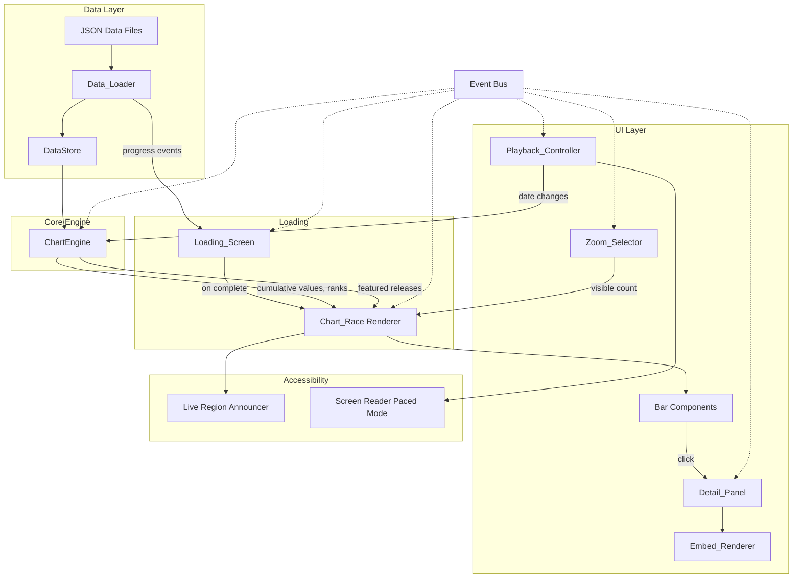
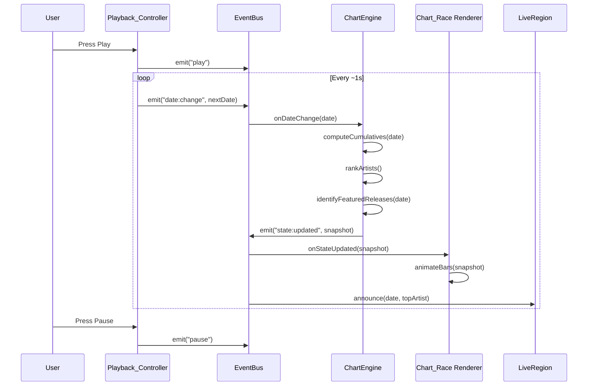

# Technical Design: K-Pop Chart Race

## Overview

This document describes the technical design for a static, animated bar chart race web application that visualizes K-pop artist chart performance over time. The application is built with vanilla TypeScript, bundled with Vite, tested with Vitest, and deployed to GitHub Pages. There is no backend; all data is loaded from JSON files at runtime.

The visualization renders horizontal bars representing artists ranked by cumulative daily performance values. Bars animate smoothly as rankings change over time. Users control playback (play/pause/scrub), select zoom levels, and click bars to open a detail panel with embedded media content (YouTube, Apple Music, Instagram, TikTok).

### Key Design Decisions

1. **No framework**: Pure DOM manipulation with TypeScript keeps the bundle small and avoids framework churn. CSS transitions and `requestAnimationFrame` handle animations.
2. **JSON file-based data**: Artist data is split across multiple JSON files (e.g., per-generation or per-group) and combined at runtime by the Data_Loader. This keeps individual files manageable for manual editing.
3. **Component-based architecture without a framework**: Each logical component (Chart_Race, Playback_Controller, Detail_Panel, etc.) is a TypeScript module that owns a DOM subtree. Components communicate via a lightweight event bus.
4. **CSS transitions for bar animation**: Bar position (top), width, and numeric values are animated using CSS transitions for position/width and `requestAnimationFrame` for numeric tweening. This offloads layout animation to the browser's compositor.
5. **Lazy embed loading**: Embed iframes in the Detail_Panel are only created when the panel opens, avoiding unnecessary network requests during chart playback.

## Architecture

### High-Level Component Diagram



### Data Flow




## Components and Interfaces

### 1. EventBus

A minimal pub/sub system for decoupled component communication.

```typescript
interface EventBus {
  on(event: string, handler: (...args: any[]) => void): void;
  off(event: string, handler: (...args: any[]) => void): void;
  emit(event: string, ...args: any[]): void;
}
```

Events:
- `data:loaded` — DataStore is ready
- `date:change(date: string)` — current date changed
- `state:updated(snapshot: ChartSnapshot)` — engine recomputed state
- `play` / `pause` — playback toggled
- `zoom:change(level: ZoomLevel)` — zoom level changed
- `bar:click(artistId: string)` — bar clicked
- `panel:close` — detail panel closed
- `loading:progress(loaded: number, total: number, artistNames: string[])` — file loaded with discovered artists
- `loading:complete` — all files loaded
- `loading:error(message: string)` — loading failed

### 2. Data_Loader

Responsible for fetching, parsing, validating, and combining JSON data files.

```typescript
interface DataLoader {
  loadAll(basePath: string): Promise<DataStore>;
}

interface DataStore {
  artists: Map<string, ArtistEntry>;
  dates: string[];               // sorted ascending
  startDate: string;
  endDate: string;
  chartWins: Map<string, Map<string, { artistIds: string[], crownLevels: Map<string, number> }>>; // date → source → { winning artistIds, crownLevel per artistId }
}
```

Validation rules:
- Skip files whose Artist_Entry has missing required fields (name, artistType, generation, releases)
- Skip entries with invalid `artistType` (not in the 5 allowed values)
- Skip entries with invalid `generation` (not a positive integer)
- Log warnings for unknown `source` values in DailyValueEntry (not in the known ChartSource set) but still include the entry
- Log warnings for skipped entries, log errors for unparseable files
- Continue loading remaining files on individual file failure

Round-trip capability:
- `serialize(artist: ArtistEntry): string` — pretty-print JSON
- `deserialize(json: string): ArtistEntry` — parse JSON to entry
- Round-trip invariant: `deserialize(serialize(entry))` ≡ `entry`
- Note: `dailyValues` entries are `DailyValueEntry` objects with `value`, `source`, and `episode` fields; embed `links` are `EmbedLink` objects with `url` and optional `description` fields (type auto-detected by Embed_Renderer from the URL)

### 3. ChartEngine

Pure computation module. No DOM access. Computes cumulative values, rankings, and featured releases for a given date.

```typescript
interface ChartEngine {
  computeSnapshot(date: string, previousSnapshot?: ChartSnapshot): ChartSnapshot;
  computeChartWins(dataStore: DataStore): Map<string, Map<string, { artistIds: string[], crownLevels: Map<string, number> }>>;
}

interface ChartSnapshot {
  date: string;
  entries: RankedEntry[];        // sorted by rank (descending cumulative)
}

interface RankedEntry {
  artistId: string;
  artistName: string;
  artistType: ArtistType;
  generation: number;
  logoUrl: string;
  cumulativeValue: number;
  previousCumulativeValue: number;
  dailyValue: number;
  rank: number;
  previousRank: number;
  featuredRelease: FeaturedReleaseInfo;
}

interface FeaturedReleaseInfo {
  title: string;
  releaseId: string;
}
```

Key behaviors:
- `cumulativeValue` = sum of all daily performance values (extracted via `.value` from each `DailyValueEntry`) from `startDate` through `date`
- Daily performance value = sum of all release entry `.value` fields for that artist on that date
- Ranking: descending by cumulative value, stable sort for ties (preserve previous order)
- Featured release: release with highest daily `.value` on current date; if all zero, retain most recent non-zero release
- Chart wins: `computeChartWins` iterates over all dates and sources, determining which artist(s) had the highest value for each (date, source) pair. Returns `Map<string, Map<string, { artistIds: string[], crownLevels: Map<string, number> }>>` (date → source → winning artistIds with crown levels). Ties result in all tied artists being winners.
- Crown level computation: For each (artistId, releaseId, source) tuple, the engine tracks the total number of wins. When an artist wins #1 for the same release on the same source, the crown level increments (max 5), regardless of whether other releases won on that source in between. Crown level 3 is the "Triple Crown."

### 4. Chart_Race Renderer

Owns the main visualization DOM subtree. Renders bars, animates transitions, manages the legend.

```typescript
interface ChartRaceRenderer {
  mount(container: HTMLElement): void;
  update(snapshot: ChartSnapshot, zoomLevel: ZoomLevel): void;
  destroy(): void;
}

type ZoomLevel = 10 | "all";
```

Rendering approach:
- Each bar is a `<div>` with CSS `transition` on `transform` (translateY for position) and `width`
- Bar height depends on zoom level: for Top 10, bar height = `viewportHeight / 10` (scaled to fill the viewport); for All, use a fixed minimum bar height (~40px) with vertical scrolling enabled
- Bar width is proportional to `cumulativeValue / maxCumulativeValue`
- Numeric value tweening uses `requestAnimationFrame` to interpolate from previous to current value
- Artist logo rendered as `` with CSS `filter: drop-shadow(...)` for halo effect
- Placeholder SVG rendered on image load error
- Legend rendered as a static element mapping each `ArtistType` to color + secondary indicator (icon/pattern)

### 5. Playback_Controller

Controls date advancement and timeline scrubbing.

```typescript
interface PlaybackController {
  mount(container: HTMLElement): void;
  play(): void;
  pause(): void;
  seekTo(date: string): void;
  isPlaying(): boolean;
  destroy(): void;
}
```

Behaviors:
- Autoplay: advance one date per ~1 second interval
- Pause: clear interval, hold current date
- Timeline scrubber: `<input type="range">` mapped to date index
- Scrub dragging: throttle updates via `requestAnimationFrame`
- Auto-pause at last date
- Screen-reader-paced mode: wait for live region announcement before advancing

### 6. Zoom_Selector

Toggle control for visible entry count.

```typescript
interface ZoomSelector {
  mount(container: HTMLElement): void;
  getLevel(): ZoomLevel;
  destroy(): void;
}
```

- Renders as a group of radio buttons or segmented control
- Default: Top 10
- Keyboard navigable (arrow keys within group)
- Emits `zoom:change` on selection

### 7. Detail_Panel

Modal/sidebar showing artist timeline with embedded media.

```typescript
interface DetailPanel {
  open(artistId: string, dataStore: DataStore): void;
  close(): void;
  isOpen(): boolean;
  destroy(): void;
}
```

Behaviors:
- Vertical timeline layout with alternating left/right entries
- Each entry: date heading, Chart_Source logo (for known sources), episode number (e.g., "Ep 480"), performance value, inline embeds
- Each date may have multiple embed groups (EmbedDateEntry[]), each with its own Event_Type label; all groups for a date are rendered in sequence
- If an embed link has a description, the description text is displayed alongside the embedded content
- Entries representing a Chart_Win are visually highlighted with an escalating crown icon based on Crown_Level (1-5), where level 3 is the "Triple Crown." Each successive level displays a progressively more elaborate crown icon
- Focus trap while open; return focus to triggering bar on close
- Full-screen overlay on mobile (<768px), sidebar on desktop (≥768px)
- Independent scroll within timeline content
- Auto-open on pause (top-ranked artist), auto-close on play
- Lazy-load embed iframes via IntersectionObserver: embed iframes are only created when their container scrolls into the viewport, preventing rendering stutter for artists with many embeds

### 8. Embed_Renderer

Converts permalinks to embedded media players.

```typescript
interface EmbedRenderer {
  render(link: EmbedLink, container: HTMLElement): void;
}
```

Supported types detected by URL pattern:
- YouTube (`youtube.com/watch`, `youtu.be/`) → `<iframe>` with `youtube.com/embed/`
- Apple Music (`music.apple.com/`) → `<iframe>` with `embed.music.apple.com/`
- Instagram (`instagram.com/p/`, `instagram.com/reel/`) → `<blockquote>` + Instagram embed script
- TikTok (`tiktok.com/`) → `<blockquote>` + TikTok embed script

When `link.description` is provided, the renderer displays the description text adjacent to the embedded content (e.g., as a caption below the embed).

Security:
- Sanitize all permalink inputs: strip query params not needed, validate URL structure
- Reject URLs not matching known patterns → render fallback link
- Fallback: `<a href="{permalink}" target="_blank" rel="noopener noreferrer">{descriptive text}</a>`

### 9. LiveRegionAnnouncer

Manages ARIA live region for screen reader announcements.

```typescript
interface LiveRegionAnnouncer {
  mount(container: HTMLElement): void;
  announce(message: string): Promise<void>;
  destroy(): void;
}
```

- Renders a visually hidden `<div role="log" aria-live="polite">`
- `announce()` returns a Promise that resolves after a delay (estimated read time) to support paced mode
- In paced mode, the Playback_Controller awaits the Promise before advancing

### 10. ScreenReaderPacedMode

Controls the configurable announcement depth for screen reader users.

```typescript
interface ScreenReaderPacedMode {
  isActive(): boolean;
  getAnnouncementCount(): number;  // default 1
  setAnnouncementCount(count: number): void;
  formatAnnouncement(snapshot: ChartSnapshot): string;
}
```

- Activated via `prefers-reduced-motion` media query heuristic
- Hidden control (visually hidden, keyboard/SR accessible) to set top-N count (1, 3, 5, 10)
- Default: top 1 (date + top-ranked artist name + cumulative value)

### 11. LoadingScreen

Displays an engaging loading experience while the Data_Loader fetches and parses JSON data files. Shown first, then replaced by the Chart_Race once loading completes.

```typescript
interface LoadingScreen {
  mount(container: HTMLElement): void;
  onFileProgress(loaded: number, total: number, artistNames: string[]): void;
  onComplete(): void;
  onError(message: string): void;
  destroy(): void;
}
```

Behaviors:
- Replaces the main visualization area during data loading
- Displays file progress indicator (e.g., "Loading... 3/12 files")
- Displays a progress bar or percentage reflecting overall loading progress
- As each file is parsed, scrolls the discovered artist name in a rapid "credits roll" animation
- On `loading:complete`, transitions smoothly (fade/slide) to the Chart_Race
- On `loading:error`, displays error message: "Unable to load chart data. Please try refreshing the page."
- If dataset is empty after loading, displays: "No chart data available."
- Listens to EventBus events: `loading:progress`, `loading:complete`, `loading:error`


## Data Models

### JSON Data Schema

Each JSON file contains a single `ArtistEntry` object. Multiple files are combined at runtime.

```typescript
// Top-level file structure
type DataFile = ArtistEntry;

interface ArtistEntry {
  name: string;                          // Artist or group name
  artistType: ArtistType;               // Classification
  generation: number;                    // Positive integer (1+)
  logo: string;                          // Relative path to logo asset
  releases: ReleaseEntry[];              // At least one required
}

type ArtistType = "boy_group" | "girl_group" | "solo_male" | "solo_female" | "mixed_group";

type ChartSource = "inkigayo" | "the_show" | "show_champion" | "music_bank";

interface ReleaseEntry {
  title: string;                         // Song or album title
  dailyValues: Record<string, DailyValueEntry>; // Date string (YYYY-MM-DD) → daily value with source
  embeds: Record<string, EmbedDateEntry[]>; // Date string → array of embed collections for that date (multiple event types per date)
}

interface DailyValueEntry {
  value: number;                         // Performance value
  source: ChartSource | string;          // Music show program; known values get logos, unknown values are accepted with a warning
  episode: number;                       // Episode number of the show (e.g., 480)
}

interface EmbedDateEntry {
  eventType: EventType;                  // Label for this date's content
  links: EmbedLink[];                    // One or more embed links (type auto-detected from URL pattern)
}

interface EmbedLink {
  url: string;                           // Embed permalink URL
  description?: string;                  // Optional, displayed alongside embed if provided
}

type EventType =
  | "trailer"
  | "mv"
  | "live_performance"
  | "release_date"
  | "chart_performance"
  | "promotion"
  | "behind_the_scenes"
  | "dance_practice"
  | "variety_show"
  | "fan_event";
```

### Example JSON Data File

```json
{
  "name": "aespa",
  "artistType": "girl_group",
  "generation": 4,
  "logo": "assets/logos/aespa.png",
  "releases": [
    {
      "title": "Supernova",
      "dailyValues": {
        "2024-05-13": { "value": 850, "source": "inkigayo", "episode": 1254 },
        "2024-05-14": { "value": 920, "source": "music_bank", "episode": 480 },
        "2024-05-15": { "value": 780, "source": "show_champion", "episode": 512 }
      },
      "embeds": {
        "2024-05-13": [
          {
            "eventType": "mv",
            "links": [
              { "url": "https://www.youtube.com/watch?v=example1", "description": "Official MV" }
            ]
          }
        ],
        "2024-05-14": [
          {
            "eventType": "live_performance",
            "links": [
              { "url": "https://www.youtube.com/watch?v=example2", "description": "Inkigayo comeback stage" },
              { "url": "https://www.instagram.com/p/example1/" }
            ]
          },
          {
            "eventType": "promotion",
            "links": [
              { "url": "https://www.instagram.com/p/example2/", "description": "Behind the scenes photo set" }
            ]
          }
        ]
      }
    }
  ]
}
```

### Internal Runtime Models

These are the computed models used after parsing:

```typescript
// Computed at load time
interface ParsedArtist {
  id: string;                            // Derived from name (slugified)
  name: string;
  artistType: ArtistType;
  generation: number;
  logoUrl: string;
  releases: ParsedRelease[];
}

interface ParsedRelease {
  id: string;                            // Derived from title (slugified)
  title: string;
  dailyValues: Map<string, DailyValueEntry>; // date → { value, source, episode }
  embeds: Map<string, ParsedEmbedDateEntry[]>; // date → array of embed info (multiple event types per date)
}

interface ParsedEmbedDateEntry {
  eventType: EventType;
  links: ParsedEmbedLink[];             // Embed links with optional descriptions (type auto-detected from URL pattern)
}

interface ParsedEmbedLink {
  url: string;                           // Permalink URL
  description?: string;                  // Optional, displayed alongside embed if provided
}

// Computed per date change
interface ChartSnapshot {
  date: string;
  entries: RankedEntry[];
}

interface RankedEntry {
  artistId: string;
  artistName: string;
  artistType: ArtistType;
  generation: number;
  logoUrl: string;
  cumulativeValue: number;
  previousCumulativeValue: number;
  dailyValue: number;
  rank: number;
  previousRank: number;
  featuredRelease: FeaturedReleaseInfo;
}

interface FeaturedReleaseInfo {
  title: string;
  releaseId: string;
}
```

### Color Palette (Colorblind-Friendly)

The five `ArtistType` colors use the Wong palette, which is distinguishable under deuteranopia, protanopia, and tritanopia:

| ArtistType     | Color (Hex) | Secondary Indicator |
|----------------|-------------|---------------------|
| boy_group      | `#0072B2`   | ▲ triangle icon     |
| girl_group     | `#D55E00`   | ● circle icon       |
| solo_male      | `#009E73`   | ◆ diamond icon      |
| solo_female    | `#CC79A7`   | ★ star icon         |
| mixed_group    | `#F0E442`   | ■ square icon       |

Each bar renders both the color and the secondary indicator, ensuring Artist_Types are distinguishable without relying solely on color.

### Crown Level Mapping

Total Chart_Wins for the same Release_Entry on the same Chart_Source escalate the crown icon through 5 levels. Level 3 is the "Triple Crown," a well-known K-pop music show achievement.

| Crown_Level | Name          | Visual Treatment                                      |
|-------------|---------------|-------------------------------------------------------|
| 1           | Win           | Basic crown icon (simple outline)                     |
| 2           | Double Win    | Slightly fancier crown (filled, subtle detail)        |
| 3           | Triple Crown  | Distinctly elaborate crown (gold, triple-point design) |
| 4           | Quad Crown    | More ornate crown (jeweled/embellished)               |
| 5           | Grand Crown   | Most elaborate crown (max tier, expandable later)     |

The count accumulates across non-consecutive wins (i.e., it does not reset when a different Release_Entry wins on that source in between). The mapping is extensible beyond 5 levels in the future.

### Chart Source Logo Mapping

Known `ChartSource` values map to static logo assets. The set is extensible by adding new values to the `ChartSource` union type and providing a corresponding logo asset.

| ChartSource       | Logo Asset Path                      |
|-------------------|--------------------------------------|
| `inkigayo`        | `assets/sources/inkigayo.png`        |
| `the_show`        | `assets/sources/the_show.png`        |
| `show_champion`   | `assets/sources/show_champion.png`   |
| `music_bank`      | `assets/sources/music_bank.png`      |

Entries with an unknown `source` value are displayed without a logo. A warning is logged during data loading.

### Generation Display

Generation values are displayed as Roman numerals prefixed with "Gen":

| Value | Display   |
|-------|-----------|
| 1     | Gen I     |
| 2     | Gen II    |
| 3     | Gen III   |
| 4     | Gen IV    |
| 5     | Gen V     |


## Correctness Properties

*A property is a characteristic or behavior that should hold true across all valid executions of a system — essentially, a formal statement about what the system should do. Properties serve as the bridge between human-readable specifications and machine-verifiable correctness guarantees.*

### Property 1: Serialization Round Trip

*For any* valid ArtistEntry object, serializing to JSON and then deserializing back SHALL produce an object equivalent to the original.

**Validates: Requirements 1.10, 1.11**

### Property 2: Validation Rejects Invalid Entries

*For any* ArtistEntry object that has a missing required field (name, artistType, generation, or at least one release with daily values), OR has an artistType not in the set ("boy_group", "girl_group", "solo_male", "solo_female", "mixed_group"), OR has a generation value that is not a positive integer, the Data_Loader SHALL reject that entry and the entry SHALL NOT appear in the resulting DataStore.

**Validates: Requirements 1.4, 1.7, 1.8**

### Property 3: Daily Performance Sum Invariant

*For any* artist and any date, the computed daily Performance_Value SHALL equal the sum of all Release_Entry DailyValueEntry `.value` fields for that artist on that date.

**Validates: Requirements 1.5, 1.12**

### Property 4: Featured Release Selection

*For any* artist with multiple releases on a given date, the Featured_Release SHALL be the Release_Entry with the highest Performance_Value on that date. When all Release_Entry Performance_Values are zero for that date, the Featured_Release SHALL be the most recent release that had a non-zero Performance_Value.

**Validates: Requirements 1.6**

### Property 5: Cumulative Value Invariant

*For any* artist and any date in the dataset, the Cumulative_Value SHALL equal the sum of that artist's daily Performance_Values from the start date through and including the current date.

**Validates: Requirements 2.1, 2.4**

### Property 6: Ranking Descending Order

*For any* ChartSnapshot, the entries SHALL be ordered in descending order of Cumulative_Value (i.e., for consecutive entries, the earlier entry's Cumulative_Value is greater than or equal to the later entry's).

**Validates: Requirements 2.2**

### Property 7: Stable Sort for Ties

*For any* ChartSnapshot where two or more artists have equal Cumulative_Values, those artists SHALL maintain their relative order from the previous snapshot.

**Validates: Requirements 2.3**

### Property 8: Bar Width Proportionality

*For any* ChartSnapshot with a non-zero maximum Cumulative_Value, each bar's width SHALL be proportional to the ratio of its Cumulative_Value to the maximum Cumulative_Value among visible entries.

**Validates: Requirements 3.3**

### Property 9: Tween Interpolation

*For any* start value, end value, and progress value t in [0, 1], the tween function SHALL return `start + (end - start) * t`. At t=0 the result SHALL equal start, and at t=1 the result SHALL equal end.

**Validates: Requirements 3.4**

### Property 10: Generation to Roman Numeral Conversion

*For any* positive integer generation value, the conversion function SHALL produce the correct Roman numeral string prefixed with "Gen " (e.g., 1 → "Gen I", 4 → "Gen IV").

**Validates: Requirements 4.7**

### Property 11: Zoom Level Filtering

*For any* ChartSnapshot and zoom level N (10 or "all"), the visible entries SHALL contain exactly min(N, total entries) entries when N is 10, or all entries when N is "all", and they SHALL be the top-N ranked entries from the full snapshot.

**Validates: Requirements 5.2**

### Property 12: Scrubber Position to Date Mapping

*For any* scrubber position within the valid range [0, dateCount - 1], the mapping function SHALL return the date at the corresponding index in the sorted date array. The mapping SHALL be monotonically increasing (higher position → later or equal date).

**Validates: Requirements 6.5**

### Property 13: Embed URL Transformation

*For any* valid permalink URL matching a supported embed type (YouTube, Apple Music, Instagram, TikTok), the Embed_Renderer SHALL produce the correct embed template for that type, with the video/content ID correctly extracted from the input URL.

**Validates: Requirements 8.1, 8.2, 8.3, 8.4**

### Property 14: Malformed URL Fallback

*For any* string that does not match any supported embed URL pattern, the Embed_Renderer SHALL produce a fallback anchor element linking to the original URL.

**Validates: Requirements 8.5**

### Property 15: Permalink Sanitization

*For any* input string (including strings containing script tags, javascript: URLs, event handler attributes, or other XSS vectors), the Embed_Renderer output SHALL NOT contain executable script content.

**Validates: Requirements 8.6**

### Property 16: Announcement Formatting

*For any* ChartSnapshot and configured announcement count N (1, 3, 5, or 10), the formatted announcement string SHALL contain the current date and exactly min(N, total entries) artist names with their Cumulative_Values.

**Validates: Requirements 11.5, 11.11**

### Property 17: Loading Progress Display

*For any* pair of integers (loaded, total) where 0 ≤ loaded ≤ total and total > 0, the LoadingScreen progress text SHALL contain both the loaded count and total count (e.g., "3/12 files"), AND the progress bar value SHALL equal loaded / total as a percentage.

**Validates: Requirements 12.2, 12.4**

### Property 18: Chart Win Determination and Crown Level

*For any* date and Chart_Source in the dataset, the Chart_Win SHALL be awarded to the artist(s) with the highest DailyValueEntry `.value` for that source on that date. If multiple artists tie for the highest value, all tied artists SHALL be winners. The Crown_Level for each winning artist SHALL equal the total count of Chart_Wins for the same Release_Entry on the same Chart_Source (capped at 5), regardless of whether other releases won on that source in between.

**Validates: Requirements 7.11**


## Error Handling

### Data Loading Errors

| Error Condition | Handling | User Impact |
|---|---|---|
| JSON file has invalid syntax | Log error with filename, skip file, continue loading others | Partial data displayed; console warning |
| ArtistEntry missing required fields | Skip file, log warning with file + entry name | Artist not shown |
| Invalid ArtistType value | Skip entry, log warning | Artist not shown |
| Invalid Generation value | Skip entry, log warning | Artist not shown |
| Unknown Chart_Source value | Log warning, include entry without source logo | Entry shown without logo |
| All JSON files fail to load | LoadingScreen displays error: "Unable to load chart data. Please try refreshing the page." | No visualization; error shown on loading screen |
| Empty dataset (no valid entries) | LoadingScreen displays info: "No chart data available." | Loading screen shows informational message |

### Loading Screen Errors

| Error Condition | Handling | User Impact |
|---|---|---|
| All JSON files fail to load | LoadingScreen shows `onError` message, no transition to Chart_Race | User sees error with refresh suggestion |
| Dataset empty after loading | LoadingScreen shows informational message via `onError` | User informed no data available |
| Partial file failures | LoadingScreen continues showing progress; Chart_Race loads with partial data | Some artists missing; loading completes normally |

### Runtime Errors

| Error Condition | Handling | User Impact |
|---|---|---|
| Artist logo fails to load | `` onerror → replace with placeholder SVG | Placeholder shown instead of logo |
| Embed iframe fails to load | Show fallback link to original permalink | User can still access content via link |
| Malformed embed permalink | Render fallback anchor with descriptive text | Graceful degradation |
| Division by zero (max cumulative = 0) | Set all bar widths to 0 | Empty bars shown |
| Date out of range on scrubber | Clamp to valid range [startDate, endDate] | Scrubber stays within bounds |
| requestAnimationFrame not available | Fall back to setTimeout | Slightly less smooth animation |

### Security

- All embed URLs are sanitized before rendering: strip dangerous protocols (`javascript:`, `data:`), reject URLs not matching known patterns
- Embed iframes use `sandbox` attribute to restrict capabilities
- External links use `rel="noopener noreferrer"` and `target="_blank"`

## Testing Strategy

### Test Framework

- **Vitest** for all unit and property-based tests
- **fast-check** (via `@fast-check/vitest` or standalone `fast-check`) for property-based testing
- **jsdom** environment in Vitest for DOM-related tests

### Property-Based Tests

Each correctness property from the design document maps to a property-based test with minimum 100 iterations. Tests use `fast-check` for random input generation.

Each test is tagged with a comment referencing the design property:
```typescript
// Feature: 0001-kpop-chart-race, Property 1: Serialization Round Trip
```

Property test targets:

| Property | Module Under Test | Generator Strategy |
|---|---|---|
| 1: Serialization Round Trip | Data_Loader (serialize/deserialize) | Generate random valid ArtistEntry objects |
| 2: Validation Rejects Invalid | Data_Loader (validate) | Generate ArtistEntry with randomly invalidated fields |
| 3: Daily Performance Sum | ChartEngine (computeDailyValue) | Generate artists with multiple releases, random dates |
| 4: Featured Release Selection | ChartEngine (identifyFeaturedRelease) | Generate artists with multiple releases, varying daily values |
| 5: Cumulative Value Invariant | ChartEngine (computeCumulatives) | Generate artist data across random date ranges |
| 6: Ranking Descending Order | ChartEngine (rankArtists) | Generate random cumulative value arrays |
| 7: Stable Sort for Ties | ChartEngine (rankArtists) | Generate arrays with intentional duplicate values |
| 8: Bar Width Proportionality | ChartRaceRenderer (computeBarWidth) | Generate random cumulative values with known max |
| 9: Tween Interpolation | tween utility | Generate random start, end, and t values |
| 10: Generation to Roman Numeral | toRomanNumeral utility | Generate random positive integers |
| 11: Zoom Level Filtering | ChartRaceRenderer (filterByZoom) | Generate snapshots of varying sizes + zoom levels |
| 12: Scrubber to Date Mapping | PlaybackController (positionToDate) | Generate random date arrays + positions |
| 13: Embed URL Transformation | Embed_Renderer (parsePermalink) | Generate random valid URLs for each embed type |
| 14: Malformed URL Fallback | Embed_Renderer (parsePermalink) | Generate random non-matching strings |
| 15: Permalink Sanitization | Embed_Renderer (sanitize) | Generate strings with XSS payloads |
| 16: Announcement Formatting | LiveRegionAnnouncer (format) | Generate random snapshots + announcement counts |
| 17: Loading Progress Display | LoadingScreen (onFileProgress) | Generate random (loaded, total) pairs with 0 ≤ loaded ≤ total |
| 18: Chart Win Determination and Crown Level | ChartEngine (computeChartWins) | Generate multiple artists with random daily values across dates and sources; verify crown levels track total wins per (artistId, releaseId, source) regardless of intervening wins by other releases |

### Unit Tests (Example-Based)

Unit tests cover specific examples, edge cases, and integration points not suited for PBT:

- **Data Loading**: Invalid JSON file handling (1.3), empty dataset, single file loading, unknown Chart_Source warning (1.9)
- **Bar Rendering**: Artist name display (4.1), logo display (4.2), value display (4.3), missing logo placeholder (4.4), color mapping (4.5), legend rendering (4.6), featured release title (4.8), logo halo effect (4.9)
- **Zoom Selector**: Default to Top 10 (5.5), all options rendered (5.1), vertical scroll when overflow (5.3)
- **Playback Controls**: Play/pause toggle (6.1-6.3), scrubber range (6.4), auto-pause at end (6.6), continuous update during drag (6.7)
- **Detail Panel**: Open/close behavior (7.1-7.3, 7.8), timeline layout (7.4), content display with source logo + episode number (7.5), multiple embed groups per date with different event types (7.5), embed link descriptions displayed alongside embeds (7.5), scroll (7.6), Chart_Win highlighting with escalating crown icons by Crown_Level (7.11), freeze-then-resolve (7.9), tap target padding (7.10), lazy-load embeds via IntersectionObserver (12.8)
- **Loading Screen**: Loading screen replaces visualization area on start (12.1), file progress indicator display (12.2), artist name scrolling animation on file parse (12.3), progress bar/percentage display (12.4), smooth transition to Chart_Race on complete (12.5), error message on total failure (12.6), informational message on empty dataset (12.7)
- **Responsive Design**: Mobile/desktop breakpoints (9.1-9.5)
- **Accessibility**: ARIA labels (11.1-11.2), keyboard navigation (11.3), focus trap (11.4), colorblind palette verification (11.6-11.8), contrast ratio calculation (11.9), paced mode activation (11.10), default count (11.12)
- **Build/Deploy**: Smoke tests for build output and configuration (10.1-10.5)

### Test Organization

```
tests/
├── unit/
│   ├── data-loader.test.ts
│   ├── chart-engine.test.ts
│   ├── chart-race-renderer.test.ts
│   ├── playback-controller.test.ts
│   ├── zoom-selector.test.ts
│   ├── detail-panel.test.ts
│   ├── embed-renderer.test.ts
│   ├── live-region.test.ts
│   ├── loading-screen.test.ts
│   └── utils.test.ts
├── property/
│   ├── data-loader.property.test.ts
│   ├── chart-engine.property.test.ts
│   ├── chart-wins.property.test.ts
│   ├── renderer.property.test.ts
│   ├── embed-renderer.property.test.ts
│   ├── playback.property.test.ts
│   └── accessibility.property.test.ts
└── setup.ts
```
