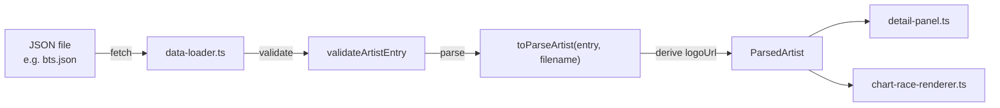

# Design Document: Data Model Enhancements

## Overview

This design covers three data model changes to the K-Pop Chart Race application:

1. Add optional `korean_name` and `debut` fields to the artist data schema and display them in the detail panel.
2. Remove the `logo` field from JSON data files and derive the logo URL from the filename slug at load time.
3. Bump the package version from 0.3.0 to 0.4.0.

These changes touch four source files (`types.ts`, `models.ts`, `data-loader.ts`, `detail-panel.ts`), all JSON data files in `public/data/`, and `package.json`.

## Architecture

No architectural changes. The existing data flow is preserved:

```
JSON files → data-loader (fetch + validate + parse) → DataStore (ParsedArtist) → UI components
```

The only change is that `toParseArtist` now receives the filename so it can derive `logoUrl` instead of reading it from the JSON entry.



## Components and Interfaces

### types.ts — ArtistEntry changes

Remove the `logo` field. Add optional `korean_name` and `debut`:

```typescript
export interface ArtistEntry {
  name: string;
  artistType: ArtistType;
  generation: number;
  korean_name?: string;   // new — Korean name
  debut?: string;         // new — ISO 8601 date (YYYY-MM-DD)
  releases: ReleaseEntry[];
  // logo field removed
}
```

### models.ts — ParsedArtist changes

Add optional `koreanName` and `debut` to the runtime model:

```typescript
export interface ParsedArtist {
  id: string;
  name: string;
  artistType: ArtistType;
  generation: number;
  logoUrl: string;
  koreanName?: string;  // new
  debut?: string;       // new
  releases: ParsedRelease[];
}
```

### data-loader.ts — toParseArtist signature change

`toParseArtist` gains a `filename` parameter. It derives `logoUrl` from the filename slug and maps `korean_name`/`debut`:

```typescript
function toParseArtist(entry: ArtistEntry, filename: string): ParsedArtist {
  const slug = filename.replace(/\.json$/i, "");
  return {
    id: slugify(entry.name),
    name: entry.name,
    artistType: entry.artistType,
    generation: entry.generation,
    logoUrl: `assets/logos/${slug}.png`,
    koreanName: entry.korean_name || undefined,
    debut: entry.debut || undefined,
    releases: /* unchanged */,
  };
}
```

The call site in `loadAll` passes the filename:

```typescript
const parsed = toParseArtist(entry, filename);
```

The `serialize`/`deserialize` round-trip functions remain unchanged — they operate on `ArtistEntry` which no longer has `logo`.

### detail-panel.ts — header display changes

In the `open` method, the header rendering updates to:

1. Show Korean name in parentheses after the English name when `koreanName` is defined.
2. Show debut date alongside the generation label when `debut` is defined.

```typescript
// Artist name with optional Korean name
const nameHtml = artist.koreanName
  ? `${this.escapeHtml(artist.name)} (${this.escapeHtml(artist.koreanName)})`
  : this.escapeHtml(artist.name);

// Meta line with optional debut
const genLabel = `${this.escapeHtml(this.formatArtistType(artist.artistType))} · ${toRomanNumeral(artist.generation)}`;
const debutHtml = artist.debut
  ? ` <span class="detail-panel__debut">(debut: ${this.escapeHtml(artist.debut)})</span>`
  : "";
```

### JSON data files

Remove the `logo` field from all files in `public/data/`. Optionally add `korean_name` and `debut` where known (e.g., BTS already has `korean_name`).

### package.json

Update `"version"` from `"0.3.0"` to `"0.4.0"`.

## Data Models

### ArtistEntry (JSON schema — types.ts)

| Field | Type | Required | Notes |
|-------|------|----------|-------|
| name | string | yes | English artist name |
| artistType | ArtistType | yes | Classification |
| generation | number | yes | Positive integer |
| korean_name | string | no | Korean name (new) |
| debut | string | no | ISO 8601 date (new) |
| releases | ReleaseEntry[] | yes | At least one with dailyValues |

`logo` field is removed.

### ParsedArtist (runtime model — models.ts)

| Field | Type | Notes |
|-------|------|-------|
| id | string | slugified from name |
| name | string | English name |
| artistType | ArtistType | |
| generation | number | |
| logoUrl | string | Derived: `assets/logos/{filename_slug}.png` |
| koreanName | string \| undefined | From korean_name |
| debut | string \| undefined | From debut |
| releases | ParsedRelease[] | |


## Correctness Properties

*A property is a characteristic or behavior that should hold true across all valid executions of a system — essentially, a formal statement about what the system should do. Properties serve as the bridge between human-readable specifications and machine-verifiable correctness guarantees.*

### Property 1: Optional field preservation round-trip

*For any* valid ArtistEntry with a non-empty `korean_name` and/or `debut`, parsing via `toParseArtist` SHALL produce a ParsedArtist where `koreanName` equals the input `korean_name` and `debut` equals the input `debut`. *For any* ArtistEntry where these fields are missing or empty strings, the corresponding ParsedArtist fields SHALL be `undefined`.

**Validates: Requirements 1.2, 1.3, 3.2, 3.3**

### Property 2: Validation accepts optional fields

*For any* valid ArtistEntry (valid name, artistType, generation, and at least one release with dailyValues), `validateArtistEntry` SHALL return `true` regardless of whether `korean_name` and `debut` are present, absent, or empty.

**Validates: Requirements 1.4, 3.4**

### Property 3: Logo URL derived from filename

*For any* filename string ending in `.json`, `toParseArtist` SHALL set `logoUrl` to `assets/logos/{slug}.png` where `{slug}` is the filename with the `.json` extension removed. The resulting `logoUrl` SHALL NOT depend on any field in the ArtistEntry.

**Validates: Requirements 5.2, 5.3, 7.1, 7.2**

### Property 4: Conditional Korean name display

*For any* ParsedArtist, the detail panel header SHALL contain the Korean name in parentheses after the English name if and only if `koreanName` is defined. When `koreanName` is undefined, no parentheses SHALL appear in the artist name heading.

**Validates: Requirements 2.1, 2.2**

### Property 5: HTML escaping of user-provided strings

*For any* ParsedArtist whose `koreanName` or `name` contains HTML special characters (`<`, `>`, `&`, `"`, `'`), the rendered header HTML SHALL contain only escaped equivalents and SHALL NOT contain raw HTML special characters within the text content.

**Validates: Requirements 2.3**

## Error Handling

| Scenario | Behavior |
|----------|----------|
| JSON file contains a `logo` field (legacy) | Ignored — TypeScript won't map it to ArtistEntry since the field is removed from the interface. No error. |
| `korean_name` is not a string | Treated as missing — `koreanName` set to `undefined`. No validation failure. |
| `debut` is not a valid ISO 8601 date | Preserved as-is (string). No validation on date format — the field is informational display-only. |
| Filename has no `.json` extension | `replace(/\.json$/i, "")` is a no-op; slug equals the full filename. Logo path still constructed. |
| `koreanName` contains HTML injection | `escapeHtml` sanitizes before rendering. |

## Testing Strategy

### Property-Based Tests (fast-check + vitest)

The project already uses `fast-check` and `@fast-check/vitest`. Each property above maps to a property-based test with a minimum of 100 iterations.

Tag format: `Feature: 0009-data-model-enhancements, Property N: <title>`

Tests go in `tests/property/data-loader.property.test.ts` (properties 1–3) and a new `tests/property/detail-panel.property.test.ts` (properties 4–5).

Generators needed:
- `arbitraryArtistEntry()`: generates valid ArtistEntry objects with random optional fields
- `arbitraryFilename()`: generates `{slug}.json` filenames with valid slug characters

### Unit Tests

Specific examples and edge cases in `tests/unit/data-loader.test.ts` and `tests/unit/detail-panel.test.ts`:

- `bts.json` → logoUrl `assets/logos/bts.png` (Req 7.3)
- `aria-bloom.json` → logoUrl `assets/logos/aria-bloom.png` (Req 7.4)
- Entry with `korean_name: "방탄소년단"` → `koreanName: "방탄소년단"` (Req 1.2)
- Entry with no `korean_name` → `koreanName: undefined` (Req 1.3)
- Header rendering with and without Korean name (Req 2.1, 2.2)
- Meta rendering with and without debut (Req 4.1, 4.2)
- Legacy JSON with `logo` field is ignored (Req 6.1)
