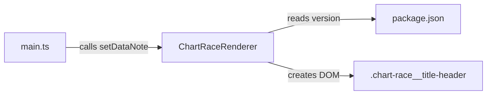

# Design Document

## Overview

Add a title header group to the top-left of the chart race area. It displays the app name ("K-Pop Chart Race"), a version badge read from `package.json` at build time, and a data-note line showing the earliest data date after loading completes. The version is bumped from 0.5.0 → 0.6.0.

## Architecture

No new modules. Changes touch four existing files:

1. `src/chart-race-renderer.ts` — create the title header DOM in `mount()`, expose `setDataNote()`.
2. `src/main.ts` — call `renderer.setDataNote(dataStore.startDate)` after data loads.
3. `src/style.css` — add CSS for the title header, version badge, and data note.
4. `package.json` — bump version to `0.6.0`.



## Components and Interfaces

### ChartRaceRenderer changes

`mount(container)` — after creating `this.wrapper`, insert a title header div before the date display:

```
.chart-race__title-header
  ├── span.chart-race__title-text  → "K-Pop Chart Race"
  ├── span.chart-race__version-badge → "v0.6.0"
  └── div.chart-race__data-note    → "" (populated later)
```

New public method:

```ts
setDataNote(startDate: string): void
```

Sets `this.dataNote.textContent` to `"Includes points earned from {startDate} forward"` if `startDate` is non-empty, otherwise leaves it blank.

New private field:

```ts
private dataNote: HTMLDivElement | null = null;
```

### main.ts changes

After `renderer.mount(app)`, add:

```ts
renderer.setDataNote(dataStore.startDate);
```

### Version import

At the top of `chart-race-renderer.ts`:

```ts
import pkg from '../package.json';
```

Vite natively supports JSON imports. The existing `vite-env.d.ts` with `/// <reference types="vite/client" />` covers the typing.

## Data Models

No new data models. Uses the existing `DataStore.startDate` string.

## Error Handling

- If `startDate` is empty or falsy, `setDataNote` renders nothing (empty text content).
- If `setDataNote` is never called, the data note div stays empty — no visual artifact.

## Testing Strategy

Property-based testing does not apply to this feature. It is purely DOM construction and CSS styling — there are no pure functions with meaningful input variation, no serialization, no algorithms. Simple example-based unit tests are sufficient.

Unit tests will verify:
- `mount()` creates the `.chart-race__title-header` element
- The title text reads "K-Pop Chart Race"
- The version badge contains "v" followed by a version string
- `setDataNote("2024-01-15")` sets the expected text
- `setDataNote("")` leaves the data note empty
- `destroy()` removes the title header along with everything else
