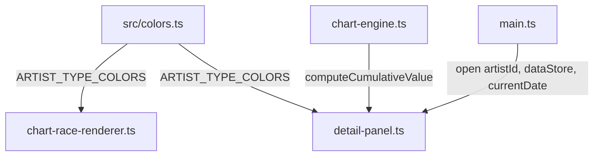

# Design Document: Detail Panel Overhaul

## Overview

This design covers a comprehensive rewrite of `src/detail-panel.ts` and associated CSS to deliver a wider panel (500px desktop), single-column centered timeline, date-grouped entries in reverse chronological order, enlarged source logos (80px), "pts" suffix on values, crown icons above points with tiered sizing, and a sticky header showing artist info with cumulative points. A new shared `src/colors.ts` module extracts `ARTIST_TYPE_COLORS` so both the renderer and detail panel can import it without duplication.

The `open()` method signature changes to accept an optional `currentDate` parameter, enabling cumulative value computation via the existing `computeCumulativeValue` from `chart-engine.ts`.

## Architecture

The overhaul touches three layers:

1. **Shared module extraction** — `src/colors.ts` exports `ARTIST_TYPE_COLORS`. Both `chart-race-renderer.ts` and `detail-panel.ts` import from it.
2. **Detail panel rewrite** — `src/detail-panel.ts` gets a new `open()` signature, sticky header, date-grouped timeline, single-column layout, larger logos, pts suffix, crown-above-points, and tiered crown sizing.
3. **Call-site updates** — `src/main.ts` passes `currentDate` (from the current snapshot) when calling `detailPanel.open()`.
4. **CSS updates** — `src/style.css` changes panel width, removes left/right alternating classes, adds sticky header styles, larger source logos, and crown tier sizing.



No new runtime dependencies. The existing `fast-check` + `vitest` stack covers testing.

## Components and Interfaces

### `src/colors.ts` (new)

```typescript
import type { ArtistType } from "./types.ts";

export const ARTIST_TYPE_COLORS: Record<ArtistType, string> = {
  boy_group: "#1565C0",
  girl_group: "#C62828",
  solo_male: "#64B5F6",
  solo_female: "#EF9A9A",
  mixed_group: "#009E73",
};
```

### `DetailPanel.open()` — updated signature

```typescript
open(artistId: string, dataStore: DataStore, currentDate?: string): void
```

When `currentDate` is provided, the method calls `computeCumulativeValue(artist, currentDate, dataStore.dates)` and displays the result in the sticky header.

### `getCrownHeight(level: number): number` — new pure function

Returns the crown icon height in pixels based on tier:
- Levels 1–6 → 24px
- Levels 7–9 → 48px
- Levels 10+ → 72px

Exported for testability.

### Sticky Header Structure

The header div gets `position: sticky; top: 0; z-index: 1` and contains:
1. Artist logo (80px, centered, with `ARTIST_TYPE_COLORS` background as a rounded rectangle)
2. Artist name (+ Korean name in parentheses if present)
3. Type label · Generation roman numeral (+ debut date if present)
4. Cumulative points with "pts" suffix (only when `currentDate` provided)

### Timeline Restructure

Instead of building flat `TimelineItem[]` and alternating left/right, the new approach:

1. Collect all items per date into a `Map<string, TimelineItem[]>`.
2. Sort date keys descending (reverse chronological).
3. Within each date group, sort chart performance entries before embed-only entries.
4. Render a single date header per group, then all entries below it in a single centered column.

### Internal types

```typescript
/** A date group containing all timeline items for that date */
interface DateGroup {
  date: string;
  items: TimelineItem[];
}
```

The existing `TimelineItem` interface remains, but the rendering loop changes from flat iteration to grouped iteration.

### Chart Performance Entry Changes

- Source logo: 80×80px (up from 20×20px)
- Episode number: centered below the logo (separate block element)
- Value: displayed with "pts" suffix (e.g., "850 pts")
- Crown: rendered above the points value (not after), using `getCrownHeight()` for sizing

### `main.ts` Call-Site Changes

```typescript
// bar:click handler
eventBus.on("bar:click", (artistId: string) => {
  if (playbackController.isPlaying()) {
    playbackController.pause();
  }
  detailPanel.open(artistId, dataStore, currentSnapshot?.date);
});

// pause handler
eventBus.on("pause", () => {
  if (currentSnapshot && currentSnapshot.entries.length > 0) {
    const topArtistId = currentSnapshot.entries[0].artistId;
    detailPanel.open(topArtistId, dataStore, currentSnapshot.date);
  }
});
```

## Data Models

No new data models are introduced. The existing `ParsedArtist`, `DataStore`, `TimelineItem`, and `DailyValueEntry` types are sufficient.

One new internal interface is added within `detail-panel.ts`:

```typescript
interface DateGroup {
  date: string;
  items: TimelineItem[];
}
```

The `getCrownHeight` function is a pure mapping:

| Crown Level | Height (px) |
|-------------|-------------|
| 1–6         | 24          |
| 7–9         | 48          |
| 10+         | 72          |


## Correctness Properties

*A property is a characteristic or behavior that should hold true across all valid executions of a system — essentially, a formal statement about what the system should do. Properties serve as the bridge between human-readable specifications and machine-verifiable correctness guarantees.*

### Property 1: Single-column layout (no left/right alternation)

*For any* artist with any number of releases and dates, when the detail panel is opened, no rendered timeline entry element SHALL have the class `timeline-entry--left` or `timeline-entry--right`.

**Validates: Requirements 2.1, 2.2**

### Property 2: One date header per unique date

*For any* artist data where multiple releases share the same date, the number of rendered date header elements SHALL equal the number of unique dates across all timeline items, and all entries for a given date SHALL be children of the same date group container.

**Validates: Requirements 3.1, 3.2, 3.3**

### Property 3: Reverse chronological date ordering

*For any* artist data with entries spanning multiple dates, the sequence of date headers in the rendered timeline SHALL be in strictly descending (newest-first) order.

**Validates: Requirements 4.1**

### Property 4: Chart performances before embeds within each date group

*For any* date group containing both chart performance entries and embed-only entries, all chart performance entries SHALL appear before all embed-only entries in DOM order.

**Validates: Requirements 4.2**

### Property 5: Source logos rendered at 80×80px

*For any* chart performance timeline entry with a recognized source, the source logo `` element SHALL have `width` and `height` attributes set to 80.

**Validates: Requirements 5.1**

### Property 6: Points display includes "pts" suffix

*For any* chart performance timeline entry, the value element's text content SHALL end with "pts".

**Validates: Requirements 6.1**

### Property 7: Crown icon appears above points value

*For any* chart performance timeline entry with a crown level greater than zero, the crown element SHALL precede the value element in DOM order within the same entry container.

**Validates: Requirements 6.2**

### Property 8: Crown height tiers

*For any* positive integer crown level, `getCrownHeight(level)` SHALL return 24 when level is 1–6, 48 when level is 7–9, and 72 when level is 10 or greater.

**Validates: Requirements 7.1, 7.2, 7.3**

### Property 9: Header background color matches artist type

*For any* artist type, the sticky header logo background element's inline style SHALL contain the color value from `ARTIST_TYPE_COLORS` for that artist type.

**Validates: Requirements 8.3, 10.2**

### Property 10: Cumulative value display matches computation

*For any* artist data and valid `currentDate`, the cumulative value displayed in the sticky header SHALL equal `computeCumulativeValue(artist, currentDate, dataStore.dates)` formatted with locale thousands separators and a "pts" suffix.

**Validates: Requirements 8.8, 9.2, 9.3**

## Error Handling

| Scenario | Behavior |
|---|---|
| `artistId` not found in `dataStore.artists` | `open()` returns early (no panel created) — existing behavior preserved |
| `currentDate` is `undefined` | Cumulative value section in sticky header is omitted |
| `currentDate` is provided but no daily values exist up to that date | Cumulative value displays "0 pts" |
| Source logo image fails to load | Falls through to text-based source name display (existing behavior) |
| Crown level is 0 | No crown element rendered (existing behavior) |
| Artist has no releases | Empty timeline rendered with sticky header only |
| `open()` called while panel is already open | Existing panel is closed first, then new one opens (existing behavior) |

## Testing Strategy

### Unit Tests

Unit tests cover specific examples and integration points:

- Panel width class: verify `detail-panel--desktop` produces 500px-width styling
- Sticky header structure: verify logo, name, Korean name, type/gen, debut, cumulative pts elements exist
- `open()` with and without `currentDate`: verify cumulative value presence/absence
- Embed order preservation within date groups
- Crown label text for specific levels (1, 3, 6, 7, 9, 10, 13)
- Episode number rendered below source logo (not inline)
- Existing tests updated: remove assertions about left/right alternation (test #6), update value assertions to include "pts" suffix

### Property-Based Tests

Using `fast-check` with vitest. Minimum 100 iterations per property.

Each property test is tagged: `Feature: 0013-detail-panel-overhaul, Property {N}: {title}`

Properties 1–7, 9–10 test DOM output by generating random artist data and opening the panel in jsdom.
Property 8 tests the pure `getCrownHeight` function directly with generated integer inputs.

### Test File Locations

- `tests/unit/detail-panel.test.ts` — updated unit tests
- `tests/property/detail-panel.property.test.ts` — updated property tests with new properties
