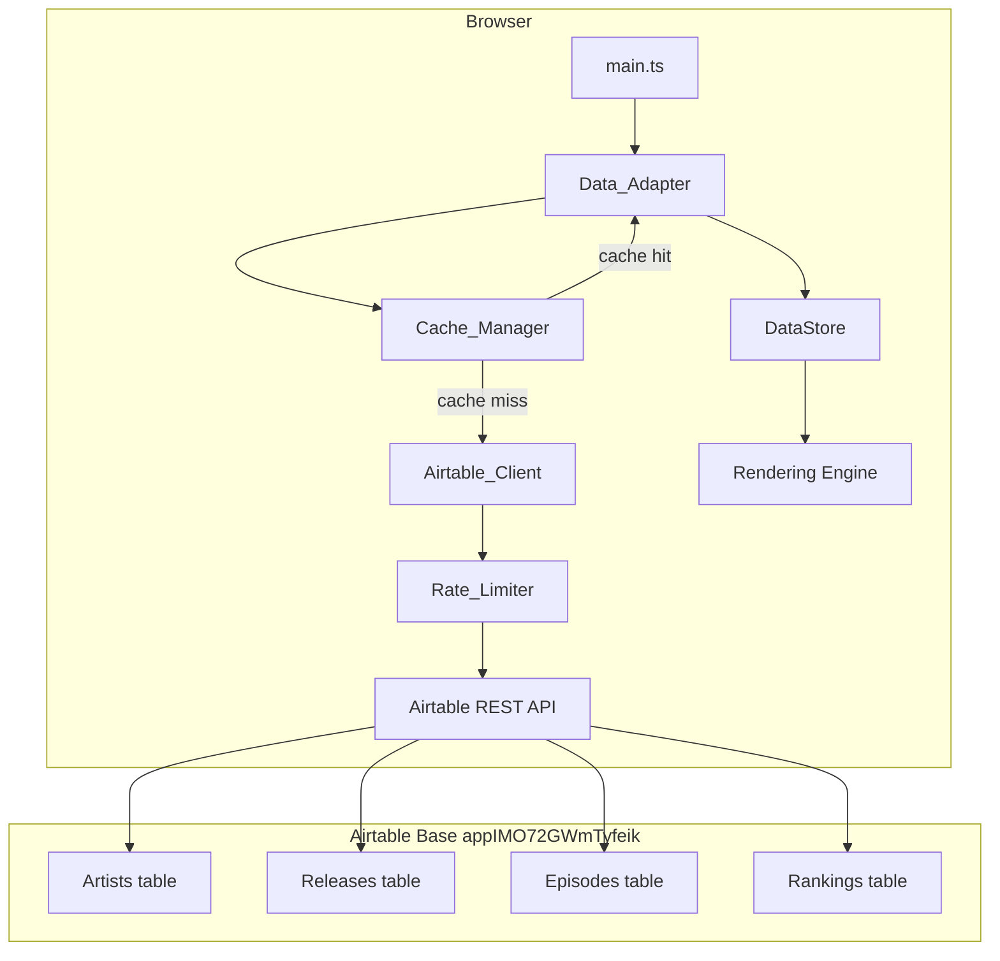
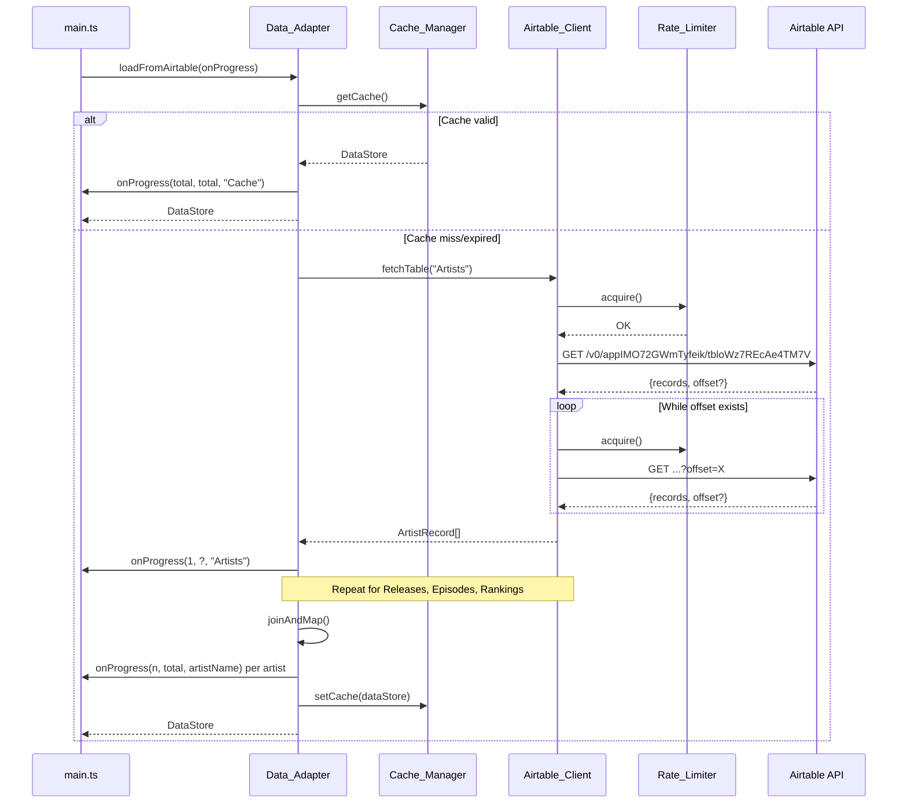

# Design Document: Airtable Data Layer

## Overview

This design replaces the existing static JSON file-based data loading pipeline with a runtime Airtable API integration. The current system fetches ~165 individual JSON files from `public/data/` via an auto-generated manifest (`index.json`), parses each into `ArtistEntry` objects, and assembles a `DataStore`. The new system fetches from 4 Airtable tables (Artists, Releases, Episodes, Rankings), joins them in-memory, and produces the identical `DataStore` interface — enabling live data updates without rebuild/redeploy.

The design introduces 4 new modules:

- **Airtable_Client** — handles authentication, pagination, rate limiting, retries, and raw record fetching
- **Rate_Limiter** — token-bucket throttle ensuring ≤5 requests/second
- **Data_Adapter** — transforms raw Airtable records into `ParsedArtist`/`ParsedRelease` objects and assembles the `DataStore`
- **Cache_Manager** — serializes/deserializes `DataStore` to `sessionStorage` with TTL and version-based invalidation

The existing `data-loader.ts` remains as a fallback reference but is no longer called from `main.ts`. The new entry point is a `loadFromAirtable()` function exported from the Data_Adapter module.

## Architecture



### Data Flow

1. `main.ts` calls `loadFromAirtable(onProgress?)`.
2. Cache_Manager checks `sessionStorage` for a valid, non-expired entry.
3. On cache miss: Airtable_Client fetches all 4 tables sequentially with pagination.
4. Data_Adapter joins records (Rankings → Episodes, Rankings → Releases, Releases → Artists).
5. Data_Adapter maps to `ParsedArtist[]`, filters invalid entries, assembles `DataStore`.
6. Cache_Manager serializes and stores the result.
7. `DataStore` is returned to `main.ts`.

### Sequencing Diagram



## Components and Interfaces

### Module: `src/airtable/rate-limiter.ts`

```typescript
/**
 * Token-bucket rate limiter: max 5 tokens per 1-second window.
 * Callers await acquire() before each HTTP request.
 */
export class RateLimiter {
  private tokens: number;
  private lastRefill: number;
  private readonly maxTokens: number;
  private readonly refillIntervalMs: number;

  constructor(maxTokens?: number, refillIntervalMs?: number);

  /** Wait until a token is available, then consume it. */
  acquire(): Promise<void>;
}
```

### Module: `src/airtable/airtable-client.ts`

```typescript
import type { RateLimiter } from "./rate-limiter";

/** Raw Airtable record with id and fields object */
export interface AirtableRecord<T = Record<string, unknown>> {
  id: string;
  fields: T;
}

/** Configuration for the Airtable client */
export interface AirtableClientConfig {
  token: string;
  baseId: string;
  rateLimiter: RateLimiter;
  timeoutMs?: number; // default: 30_000
}

/**
 * Fetches all records from a table, handling pagination and 429 retries.
 */
export class AirtableClient {
  constructor(config: AirtableClientConfig);

  /**
   * Fetch all records from a table, paginating through all pages.
   * @param tableId - The Airtable table ID
   * @returns Array of all records
   * @throws Error on HTTP errors, timeout, or exhausted retries
   */
  fetchAll<T>(tableId: string): Promise<AirtableRecord<T>[]>;
}
```

### Module: `src/airtable/cache-manager.ts`

```typescript
import type { DataStore } from "../models";

export interface SerializedDataStore {
  version: string;
  timestamp: number;
  data: unknown; // Maps converted to [key, value][] arrays
}

export class CacheManager {
  private readonly storageKey: string;
  private readonly ttlMs: number; // 3_600_000 (1 hour)
  private readonly cacheVersion: string;

  constructor();

  /** Attempt to load a valid, non-expired DataStore from sessionStorage. */
  get(): DataStore | null;

  /** Serialize and store a DataStore into sessionStorage. */
  set(store: DataStore): void;

  /** Check if cache should be bypassed (URL contains ?nocache). */
  shouldBypass(): boolean;

  /** Clear any existing cache entry. */
  clear(): void;
}
```

### Module: `src/airtable/data-adapter.ts`

```typescript
import type { DataStore } from "../models";

export type ProgressCallback = (loaded: number, total: number, name: string) => void;

/**
 * Orchestrates fetching, joining, and assembling the DataStore from Airtable.
 * Drop-in replacement for the old loadAll() function.
 */
export async function loadFromAirtable(
  onProgress?: ProgressCallback,
): Promise<DataStore>;
```

### Module: `src/airtable/show-name-map.ts`

```typescript
/** Maps Airtable show display names to ChartSource identifiers. */
export const SHOW_NAME_MAP: ReadonlyMap<string, string> = new Map([
  ["The Show", "the_show"],
  ["Show Champion", "show_champion"],
  ["M Countdown", "m_countdown"],
  ["Music Bank", "music_bank"],
  ["Show! Music Core", "show_music_core"],
  ["Inkigayo", "inkigayo"],
]);

/**
 * Convert a show display name to its ChartSource string.
 * Falls back to lowercased with non-alphanumeric replaced by underscores.
 */
export function toChartSource(displayName: string): string;
```

### Integration in `main.ts`

```typescript
// Replace:  import { loadAll } from "./data-loader.ts";
// With:     import { loadFromAirtable } from "./airtable/data-adapter.ts";

dataStore = await loadFromAirtable((loaded, total, name) => {
  loadingScreen.onFileProgress(loaded, total, [name]);
});
```

### CI/CD Changes (`deploy.yml`)

```yaml
- run: npm run build
  env:
    VITE_AIRTABLE_API_TOKEN: ${{ secrets.API_AIRTABLE_TOKEN }}
```

A pre-build validation step ensures the token is set:

```yaml
- name: Validate Airtable token
  run: |
    if [ -z "$VITE_AIRTABLE_API_TOKEN" ]; then
      echo "::error::VITE_AIRTABLE_API_TOKEN is not set"
      exit 1
    fi
  env:
    VITE_AIRTABLE_API_TOKEN: ${{ secrets.API_AIRTABLE_TOKEN }}
```

## Data Models

### Airtable Table Schemas (Field → TypeScript mapping)

#### Artists Table (`tbloWz7REcAe4TM7V`)

| Airtable Field | Type | Maps to |
|---|---|---|
| `Full Name` | Formula (string) | `ParsedArtist.name` |
| `Native Name` | Single line text | `ParsedArtist.koreanName` (undefined if empty) |
| `Type` | Single select | `ParsedArtist.artistType` (via snake_case map) |
| `Gen` | Single line text | `ParsedArtist.generation` (parseInt) |
| `Debut` | Date (ISO string) | `ParsedArtist.debut` (undefined if empty) |
| `logo_name` | Formula (string) | `ParsedArtist.id` and `ParsedArtist.logoUrl` |
| `Releases` | Linked records | Used for joining |

#### Releases Table (`tbl1LNqB2Aqsra6Jd`)

| Airtable Field | Type | Maps to |
|---|---|---|
| `Name` | Single line text | `ParsedRelease.title`, slugified → `ParsedRelease.id` |
| `Artists` | Linked records | Links to Artist record IDs |
| `Date` | Date | Embed date key (for `release_date`, `mv`) |
| `Apple Music` | URL | `release_date` embed url |
| `MV` | URL | `mv` embed url |
| `Rankings` | Linked records | Used for joining |

#### Episodes Table (`tblcWb6XwuZnw6pNk`)

| Airtable Field | Type | Maps to |
|---|---|---|
| `Date` | Date (ISO string) | `dailyValues` date key, `live_performance` embed date key |
| `Show` | Single select | `DailyValueEntry.source` via Show_Name_Map |
| `Episode` | Number | `DailyValueEntry.episode` |

#### Rankings Table (`tblqtNRBa5FEkJX8T`)

| Airtable Field | Type | Maps to |
|---|---|---|
| `Score` | Number | `DailyValueEntry.value` |
| `Release` | Linked record (1) | Links to Release record ID |
| `Episode` | Linked record (1) | Links to Episode record ID |
| `Performance` | URL | `live_performance` embed url |

### Type Mapping Lookup

```typescript
const ARTIST_TYPE_MAP: Record<string, ArtistType> = {
  "Boy Group": "boy_group",
  "Girl Group": "girl_group",
  "Solo Male": "solo_male",
  "Solo Female": "solo_female",
  "Mixed Group": "mixed_group",
};
```

### Cache Serialization Format

```typescript
interface SerializedCache {
  version: "airtable-v1";       // bumped on schema changes
  timestamp: number;            // Date.now() at write time
  data: {
    artists: [string, SerializedArtist][];   // Map → array of pairs
    dates: string[];
    startDate: string;
    endDate: string;
    firstAppearance: [string, string][];
    chartWins: [];  // always empty, recomputed downstream
  };
}
```

Maps are serialized as `Array<[key, value]>` pairs and restored via `new Map(pairs)`.


## Correctness Properties

*A property is a characteristic or behavior that should hold true across all valid executions of a system — essentially, a formal statement about what the system should do. Properties serve as the bridge between human-readable specifications and machine-verifiable correctness guarantees.*

### Property 1: Whitespace token rejection

*For any* string composed entirely of whitespace characters (spaces, tabs, newlines, or empty string), initializing the Airtable_Client with that string as the token SHALL throw an error indicating the token is missing.

**Validates: Requirements 1.2**

### Property 2: Pagination completeness

*For any* sequence of paginated Airtable responses (N pages, each containing 1–100 records with offset tokens linking pages), the total records returned by `fetchAll()` SHALL equal the sum of records across all pages, and all records SHALL be present in the returned array.

**Validates: Requirements 2.5**

### Property 3: Rate limiter throughput constraint

*For any* batch of N concurrent `acquire()` calls (where N > 5), the elapsed time from the first call resolving to the last call resolving SHALL be at least `Math.floor((N - 5) / 5) * 1000` milliseconds, ensuring no more than 5 tokens are consumed per 1-second window.

**Validates: Requirements 3.1, 3.2**

### Property 4: Artist record field mapping

*For any* valid Artist Airtable record (with non-empty `Full Name`, valid `Type`, valid `Gen`, and non-empty `logo_name`), the produced `ParsedArtist` SHALL satisfy:
- `id` equals the `logo_name` field value
- `name` equals the `Full Name` field value
- `logoUrl` equals `assets/logos/${logo_name}.svg`
- `generation` equals `parseInt(Gen)`
- `koreanName` equals the `Native Name` value when non-empty, otherwise `undefined`
- `debut` equals the `Debut` value when non-empty, otherwise `undefined`

**Validates: Requirements 4.1, 4.2, 4.4, 4.5, 4.6, 4.7**

### Property 5: Multi-artist release duplication

*For any* Release record linking to N Artists (N ≥ 1), the Data_Adapter SHALL produce exactly N `ParsedRelease` instances (one in each linked artist's `releases` array) where each instance has identical `title`, `id` (slugified Name), `dailyValues` entries, and `embeds` entries.

**Validates: Requirements 5.1, 5.2, 5.3, 5.4**

### Property 6: Ranking-to-DailyValue mapping

*For any* Ranking record with a linked Release and a linked Episode (where the Episode has a Date, Show, and Episode number), the Data_Adapter SHALL produce a `DailyValueEntry` where `value` equals the Ranking `Score`, the Map key equals the Episode `Date`, `source` equals `toChartSource(Episode.Show)`, and `episode` equals the Episode number.

**Validates: Requirements 6.1, 6.2, 6.3, 6.4**

### Property 7: Embed generation and type ordering

*For any* set of Release and Ranking records, the produced embeds Map SHALL:
- Contain only entries of type `release_date`, `mv`, or `live_performance`
- For each date key with multiple embeds, order them as `release_date` first, then `mv`, then `live_performance`
- Include a `release_date` entry for any Release with both a `Date` and `Apple Music` URL
- Include an `mv` entry for any Release with both a `Date` and `MV` URL
- Include a `live_performance` entry for any Ranking with a `Performance` URL whose linked Episode has a `Date`

**Validates: Requirements 7.1, 7.2, 7.3, 7.4, 7.5**

### Property 8: DataStore assembly invariants

*For any* set of valid mapped artists (each having at least one release with at least one `dailyValues` entry), the assembled `DataStore` SHALL satisfy:
- `artists` Map keys equal each artist's `id`
- `dates` array contains every unique date across all `dailyValues` Maps, is sorted lexicographically ascending, and has no duplicates
- `startDate` equals `dates[0]` and `endDate` equals `dates[dates.length - 1]` (or both empty strings if `dates` is empty)
- `firstAppearance.get(artistId)` equals the lexicographically earliest date across all of that artist's releases' `dailyValues` keys
- Artists with zero `dailyValues` entries across all releases are excluded from the `artists` Map

**Validates: Requirements 8.1, 8.2, 8.3, 8.5, 8.6**

### Property 9: Cache TTL expiry

*For any* timestamp T and current time NOW, a cache entry written at T SHALL be considered expired if and only if `NOW - T > 3_600_000` (1 hour in milliseconds).

**Validates: Requirements 9.2, 9.7**

### Property 10: Show name fallback format

*For any* show display name string not present in the Show_Name_Map, the `toChartSource()` function SHALL return the input lowercased with all non-alphanumeric characters replaced by underscores.

**Validates: Requirements 14.7**

### Property 11: Round-trip equivalence with JSON loader

*For any* valid set of artist data representable both as a JSON `ArtistEntry` file and as equivalent Airtable records (Artists + Releases + Rankings + Episodes), the Data_Adapter SHALL produce a `ParsedArtist` whose `id`, `name`, `koreanName`, `artistType`, `generation`, `debut`, `logoUrl` are value-equal to those produced by `toParseArtist()`, and whose `dailyValues` and `embeds` Maps contain entries with identical keys and values (embeds compared as sets per date key, ignoring intra-date ordering).

**Validates: Requirements 15.1, 15.2, 15.3, 15.4, 15.5**

## Error Handling

### Error Categories

| Category | Source | Behavior |
|---|---|---|
| Missing token | Module init | Throw synchronously with descriptive message |
| HTTP 4xx/5xx | Airtable API | Throw with status code + API error message |
| HTTP 429 | Airtable API | Retry with exponential backoff (3s, 5s, 10s), throw after 3 retries |
| Network failure | fetch() | Throw with "network connectivity" message |
| Timeout | fetch() | Abort after 30s, throw with "request timed out" message |
| Zero valid artists | Data_Adapter | Throw with "no chart data available" message |
| Invalid artist record | Data_Adapter | Skip with console.warn, continue processing |
| Invalid ranking/release | Data_Adapter | Skip with console.warn, continue processing |
| Cache deserialize fail | Cache_Manager | Clear invalid entry, fetch fresh (silent recovery) |
| QuotaExceededError | sessionStorage | Catch, clear partial entry, continue without cache |

### Error Propagation

All errors from Airtable_Client and Data_Adapter propagate as rejected Promises to `main.ts`, which passes the message to `loadingScreen.onError(message)`. The loading screen displays the error with a user-friendly message.

### Graceful Degradation

- Individual invalid records (artists, releases, rankings) are skipped with warnings — they don't fail the entire load.
- Cache failures (read or write) degrade to a fresh fetch — they don't block the application.
- Unknown show names fall back to a slugified version rather than failing.

## Testing Strategy

### Property-Based Tests (fast-check)

The project already uses `fast-check` (v4.6.0) with `@fast-check/vitest` (v0.4.0). Property tests go in `tests/property/`.

**Configuration**: Each property test runs a minimum of 100 iterations.

**Tag format**: Each test is annotated with:
```
// Feature: airtable-data-layer, Property N: <property text>
```

**Properties to implement**:
1. Whitespace token rejection — generate arbitrary whitespace strings
2. Pagination completeness — generate random page sequences with offset chains
3. Rate limiter throughput — generate request counts (6–30), verify timing
4. Artist record field mapping — generate valid artist field objects
5. Multi-artist release duplication — generate releases linked to 1–5 artists
6. Ranking-to-DailyValue mapping — generate random scores, dates, shows, episodes
7. Embed generation and ordering — generate releases/rankings with various URL combinations
8. DataStore assembly invariants — generate sets of valid artists
9. Cache TTL expiry — generate random timestamps relative to "now"
10. Show name fallback — generate random non-mapped show name strings
11. Round-trip equivalence — generate artist data, build both JSON and Airtable representations, compare outputs

### Unit Tests (example-based)

Unit tests in `tests/unit/` covering:

- All 6 show name mappings (Requirement 14.1–14.6)
- Artist type mappings for all 5 values (Requirement 4.3)
- Invalid artist type → skip (Requirement 4.8)
- Invalid generation → skip (Requirement 4.9)
- Release with zero linked artists → skip (Requirement 5.5)
- Ranking with no Episode → skip (Requirement 6.5)
- Ranking with no Release → skip (Requirement 6.6)
- Embed skipped when Episode has no Date (Requirement 7.6)
- Network failure error message format (Requirement 11.2)
- Timeout error behavior (Requirement 11.3)
- Zero valid artists → error thrown (Requirement 11.4)
- Cache bypass with `?nocache` parameter (Requirement 9.5)
- Cache version mismatch invalidation (Requirement 9.6)
- Retry exhaustion after 3 attempts (Requirement 3.4)
- Progress callback: per-table during fetch (Requirement 10.1)
- Progress callback: single "Cache" call on cache hit (Requirement 10.4)
- Empty DataStore: startDate/endDate are empty strings (Requirement 8.4)

### Integration Tests

- CI/CD: deploy.yml contains `VITE_AIRTABLE_API_TOKEN` env var on build step
- CI/CD: validation step fails on empty token
- Token not committed in any source file

### Test Dependencies

No new dependencies required — the project already has:
- `vitest` (^4.1.4) for test runner
- `fast-check` (^4.6.0) for property-based testing
- `@fast-check/vitest` (^0.4.0) for vitest integration

Mocking strategy:
- `fetch` is mocked via `vi.fn()` for Airtable_Client tests
- `sessionStorage` is mocked via a simple in-memory implementation for Cache_Manager tests
- `import.meta.env` is stubbed via Vite's test env configuration
