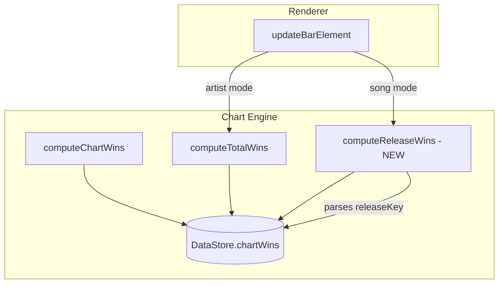

# Design Document: Song Mode Wins Display

## Overview

This feature adds per-release win count display to the race view in song mode. Currently, the `computeTotalWins` function in the chart engine only supports artist-level win lookup — it searches `dataStore.chartWins` for entries matching an `artistId`. In song mode, each bar's `artistId` field is actually a `releaseKey` (format `${artistId}::${releaseId}`), which never matches any real artist ID in the chart wins data, resulting in zero wins always being displayed.

The solution introduces a new `computeReleaseWins` function that:
1. Parses the release key to extract the underlying artist ID(s) and release ID.
2. Iterates the chart wins data to count wins where the release's artist(s) won AND the winning value came from that specific release.
3. Returns the cumulative per-release win count up to a given date.

The renderer is then updated to call this new function (instead of `computeTotalWins`) when in song mode, applying the same styling, positioning, and formatting already used for artist mode wins.

## Architecture



The architecture change is minimal — a single new function in `chart-engine.ts` and a conditional branch in `updateBarElement` to call it when `entry.mode === "songs"`.

## Components and Interfaces

### New Function: `computeReleaseWins`

**Location:** `src/chart-engine.ts`

```typescript
/**
 * Compute the total number of chart wins for a specific release
 * up to and including the given date.
 *
 * @param releaseKey - Composite key in format `${artistId}::${releaseId}`
 * @param date - The cutoff date (inclusive, YYYY-MM-DD)
 * @param dataStore - The loaded DataStore with chartWins and artists
 * @returns The cumulative win count for this release
 */
export function computeReleaseWins(
  releaseKey: string,
  date: string,
  dataStore: DataStore,
): number
```

**Algorithm:**
1. Parse `releaseKey` to extract `primaryArtistId` and `releaseId`.
2. Look up the release from `dataStore.artists` to get the full `artistIds` array (co-artists).
3. Iterate `dataStore.chartWins` entries for dates ≤ `date`.
4. For each `(date, source)` pair, check if any of the release's `artistIds` appear in `winData.artistIds`.
5. If an artist matches, verify the win came from the specific release by checking that the release had the max value on that (date, source) via the `winCounts` tracking in `computeChartWins` — or equivalently, by re-deriving which release contributed the winning value.
6. Increment the count for each confirmed match.
7. Return the total count.

**Design Decision — Win Attribution:** The existing `computeChartWins` function already tracks wins at the `(artistId, releaseId, source)` granularity internally (via the `winCounts` map with key format `${artistId}|${releaseId}|${source}`). However, this data is not exposed in the output `chartWins` map on `DataStore`. Two approaches:

- **Option A (chosen):** Extend `DataStore.chartWins` to also store per-release win information, or add a parallel lookup structure (e.g., a `releaseWins` map keyed by `${artistId}::${releaseId}` → per-date cumulative count).
- **Option B:** Re-derive win attribution in `computeReleaseWins` by checking which release had the highest value for the winning artist on each (date, source).

**Option A is preferred** because `computeChartWins` already computes this information during its single pass — we simply need to expose it. This avoids redundant O(n) scans on every frame.

**Proposed Addition to DataStore:**

```typescript
/** Maps releaseKey → array of dates on which that release won */
releaseWinDates: Map<string, string[]>;
```

This is populated during `computeChartWins` and provides O(1) lookup: count entries ≤ date via binary search.

### Modified Function: `updateBarElement`

**Location:** `src/chart-race-renderer.ts`

The existing line:
```typescript
const totalWins = computeTotalWins(entry.artistId, snapshotDate, dataStore);
```

Becomes:
```typescript
const totalWins = entry.mode === "songs"
  ? computeReleaseWins(entry.releaseKey!, snapshotDate, dataStore)
  : computeTotalWins(entry.artistId, snapshotDate, dataStore);
```

No other changes are needed in the renderer — the goalpost label and normal bar display logic already handle win counts uniformly once `totalWins` is computed.

## Data Models

### Extended DataStore

```typescript
export interface DataStore {
  // ... existing fields ...

  /**
   * Maps releaseKey (format: `${artistId}::${releaseId}`) to a sorted array
   * of dates on which that release won a chart show.
   * Multiple entries for the same date are possible (wins on different sources).
   * Array is sorted chronologically for efficient binary-search lookups.
   */
  releaseWinDates: Map<string, string[]>;
}
```

### Relationship to Existing `chartWins`

The existing `chartWins` structure:
```
Map<date, Map<source, { artistIds: string[]; crownLevels: Map<string, number> }>>
```

stores per-date, per-source winner information at the artist level. The new `releaseWinDates` structure complements this by providing a release-centric view: for each release, which dates did it win on (across all sources)?

This is computed once during `computeChartWins` and stored alongside the existing data.

## Correctness Properties

*A property is a characteristic or behavior that should hold true across all valid executions of a system — essentially, a formal statement about what the system should do. Properties serve as the bridge between human-readable specifications and machine-verifiable correctness guarantees.*

### Property 1: Per-release win computation correctness

*For any* valid DataStore with chart wins data, and *for any* releaseKey and date, `computeReleaseWins(releaseKey, date, dataStore)` SHALL return a count equal to the number of (date, source) pairs where (a) the date is ≤ the query date, (b) one of the release's credited artist IDs appears in the winners, and (c) the release was the one that contributed the winning value for that artist on that source.

**Validates: Requirements 1.1, 1.4, 1.5**

### Property 2: Win attribution specificity

*For any* artist with multiple releases, and *for any* (date, source) pair where that artist wins, only the specific release that had the maximum value on that (date, source) SHALL have its win count incremented — other releases from the same artist SHALL NOT receive a win for that (date, source).

**Validates: Requirements 1.2**

### Property 3: Co-artist win inclusion

*For any* release with multiple credited artist IDs, if *any* of those artist IDs appear in the winners for a (date, source) pair and the release contributed the winning value, the release SHALL receive a win for that pair.

**Validates: Requirements 1.3**

### Property 4: Win count display formatting

*For any* song-mode bar with a computed win count, when wins > 0 the displayed text SHALL be `"{count} win"` for count=1 and `"{count} wins"` for count≥2, and when wins = 0 the wins element SHALL be hidden (display="none").

**Validates: Requirements 2.1, 2.2, 2.3**

### Property 5: Goalpost label wins formatting

*For any* song-mode goalpost bar, when the release has wins > 0 the goalpost label SHALL end with `" · {count} win"` or `" · {count} wins"`, and when wins = 0 the label SHALL not contain any wins segment.

**Validates: Requirements 3.1, 3.2**

### Property 6: Cumulative wins monotonicity over time

*For any* release and *for any* two dates where date1 ≤ date2, `computeReleaseWins(releaseKey, date1, dataStore)` SHALL be ≤ `computeReleaseWins(releaseKey, date2, dataStore)`. Additionally, if a release wins on date D, the count at date D SHALL be exactly 1 greater than the count at the latest date before D that has no win for this release on the same source.

**Validates: Requirements 4.1, 4.2, 4.3**

## Error Handling

| Scenario | Handling |
|----------|----------|
| `releaseKey` format is invalid (no `::` separator) | Return 0 wins. The function should not throw. |
| `releaseKey` references a non-existent artist or release | Return 0 wins. The release simply has no win data. |
| `dataStore.releaseWinDates` is undefined (backward compat) | Return 0 wins. Graceful fallback for older data. |
| Date string is empty or malformed | Return 0 wins. No dates will match `≤ ""`. |

All error cases result in 0 wins displayed, which is the safe default — it means the user sees no crown/wins badge rather than an incorrect count or a runtime error.

## Testing Strategy

### Property-Based Tests (fast-check)

Property-based testing is appropriate for this feature because:
- `computeReleaseWins` is a pure function with clear input/output behavior
- The input space (combinations of artists, releases, dates, sources, values) is large
- Universal properties like monotonicity and attribution specificity hold across all inputs
- The existing project already uses `fast-check` extensively for chart engine properties

**Library:** `fast-check` (already in devDependencies)  
**Minimum iterations:** 100 per property  
**Test file:** `tests/property/song-mode-wins.property.test.ts`

Each property test will be tagged with:
```
// Feature: song-mode-wins-display, Property {N}: {title}
```

**Properties to implement:**
1. Per-release win computation correctness (oracle-based comparison)
2. Win attribution specificity (multi-release artist, only winning release gets credit)
3. Co-artist win inclusion (any co-artist winning counts the release)
4. Win count display formatting (correct text for song-mode bars)
5. Goalpost label wins formatting (correct compact label format)
6. Cumulative wins monotonicity (non-decreasing over time)

### Unit Tests (example-based)

**Test file:** `tests/unit/song-mode-wins.test.ts`

Concrete scenarios:
- A release with exactly 1 win displays "1 win"
- A release with 5 wins across different sources displays "5 wins"
- A release with 0 wins has hidden wins element
- DOM element ordering: winsSpan follows valueSpan
- Goalpost label format with wins: `"#1 · Song Title · 1,234 · 3 wins"`
- Goalpost label format without wins: `"#1 · Song Title · 1,234"` (no trailing segment)
- Co-artist release: wins counted when secondary artist wins
- Multiple releases from same artist: only the correct release gets the win
- Scrubbing backward: win count decreases to earlier value
