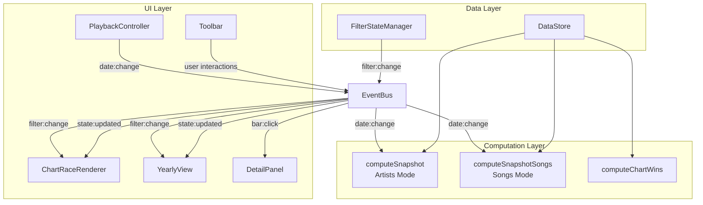

# Design Document: UI Overhaul — Songs, Filters & Toolbar

## Overview

This design extends the K-Pop Chart Race application to support a dual display mode (Songs/Artists), generation-based filtering, a unified persistent toolbar, and a shortened inactive window. The core architectural change is introducing a centralized `FilterState` object that replaces scattered local variables in `main.ts`, and a new `computeSnapshotSongs` function in `chart-engine.ts` that produces one `RankedEntry` per release rather than per artist.

The design preserves the existing EventBus-driven architecture and the separation between pure computation (`chart-engine.ts`) and rendering (`chart-race-renderer.ts`, `yearly-view.ts`). New components are introduced for the toolbar and filter state management, while existing components receive targeted extensions.

### Key Design Decisions

1. **Centralized FilterState over scattered variables** — All filter/toggle values move into a single `FilterState` object managed by a `FilterStateManager` class. This ensures consistency across views, simplifies persistence during view switches, and provides a single source of truth for the toolbar UI.

2. **Separate snapshot function for Songs mode** — Rather than adding conditional branches throughout `computeSnapshot`, a parallel `computeSnapshotSongs` function produces release-level entries. This keeps the existing artist-mode path untouched and testable in isolation.

3. **Co-artists as an array on ParsedRelease** — Each release gains an `artistIds: string[]` field referencing participating artists. This is the minimal data model extension needed to support multi-artist songs.

4. **Toolbar as a standalone DOM component** — A new `Toolbar` class owns all filter/toggle controls and communicates via the EventBus. This replaces the ad-hoc control creation scattered across `main.ts`.

5. **3-day inactive window as a constant** — The `14` in `filterByActivity` becomes a configurable constant defaulting to `3`, requiring minimal code change.

## Architecture



### Data Flow

1. **Initialization**: Load data → build `DataStore` → initialize `FilterStateManager` with defaults (Songs mode, All generations, All sources, zoom 10) → mount `Toolbar` → emit initial `date:change`.

2. **Filter change**: User interacts with toolbar → `Toolbar` emits `filter:change` on EventBus → `FilterStateManager` updates internal state → main orchestrator re-computes snapshot using appropriate engine function → emits `state:updated`.

3. **View switch**: User toggles Race/Yearly → `FilterStateManager` preserves all values → target view mounts with preserved state → no flash of unfiltered content.

4. **Mode switch** (Songs↔Artists): `FilterStateManager` updates `displayMode` → snapshot recomputed with the appropriate function → renderer receives entries keyed by either `releaseId` or `artistId`.

## Components and Interfaces

### FilterStateManager

Central state holder for all filter values. Emits events on change.

```typescript
interface FilterState {
  displayMode: "songs" | "artists";
  generation: number | "all";
  source: string;           // ChartSource | "all"
  zoom: ZoomLevel;          // 10 | "all"
  view: "race" | "yearly";
  metric: "points" | "wins"; // yearly-view only
}

class FilterStateManager {
  private state: FilterState;
  private eventBus: EventBus;

  constructor(eventBus: EventBus, initial?: Partial<FilterState>);

  getState(): Readonly<FilterState>;
  update(partial: Partial<FilterState>): void; // emits "filter:change"
  reset(): void; // restore defaults
}
```

**Default state on init:**
```typescript
{
  displayMode: "songs",
  generation: "all",
  source: "all",
  zoom: 10,
  view: "race",
  metric: "points",
}
```

### Toolbar

Persistent horizontal component rendered at the top of the viewport.

```typescript
class Toolbar {
  constructor(eventBus: EventBus, filterState: FilterStateManager);

  mount(container: HTMLElement): void;
  unmount(): void;
  /** Update available generations from data */
  setGenerations(generations: number[]): void;
  /** Show/hide yearly-only controls */
  setViewMode(view: "race" | "yearly"): void;
}
```

**Layout (left to right):**
- Generation Filter (dropdown: "All", 5th Gen, 4th Gen, 3rd Gen, …)
- Source Filter (dropdown: "All", then 6 shows)
- Points/Wins toggle (visible only in yearly view)
- Race/Yearly view switcher
- Zoom Toggle (10/All)
- Songs/Artists mode toggle

**Mobile (< 768px):** Collapses into an expandable drawer with chip summary of active non-default filters.

### Extended EventMap

```typescript
interface EventMap {
  // ... existing events ...
  "filter:change": (state: FilterState) => void;
  "bar:click": (id: string) => void; // artistId in Artists mode, releaseId in Songs mode
}
```

### computeSnapshotSongs

New pure function in `chart-engine.ts`:

```typescript
function computeSnapshotSongs(
  date: string,
  dataStore: DataStore,
  filterState: FilterState,
  previousSnapshot?: ChartSnapshot,
): ChartSnapshot;
```

Produces one `RankedEntry` per release where:
- `artistId` → set to a composite release identifier (e.g., `${artistId}::${releaseId}`)
- `artistName` → release title (primary label)
- `featuredRelease.title` → artist name(s) joined by " • " (secondary label)
- `logoUrl` → first artist's logo (used as fallback; renderer uses `coArtists` array for multi-logo display)
- `coArtists` → full resolved artist array (all logos, names, types) for rendering side-by-side
- `cumulativeValue` → sum of that release's `dailyValues` up to `date`, filtered by source if set

### Extended RankedEntry

```typescript
interface RankedEntry {
  // ... existing fields ...
  /** In Songs mode, the unique release identifier */
  releaseKey: string;
  /** In Songs mode, array of resolved artist data for co-artists */
  coArtists?: ResolvedArtist[];
  /** Display mode that produced this entry */
  mode: "songs" | "artists";
}

interface ResolvedArtist {
  id: string;
  name: string;
  logoUrl: string;
  artistType: ArtistType;
  generation: number;
}
```

### Generation Filtering in Computation

Generation filtering is applied at computation time (not rendering time) so that filtered-out entries don't affect rankings:

```typescript
function applyGenerationFilter(
  entries: RankedEntry[],
  generation: number | "all",
): RankedEntry[];
```

In Songs mode, a release passes the filter if **at least one** of its co-artists belongs to the selected generation.

### Source Filtering in Computation

Source filtering happens inside `computeSnapshotSongs` and an extended `computeSnapshot`:

```typescript
function computeCumulativeValueFiltered(
  artist: ParsedArtist,
  date: string,
  dates: string[],
  source: string, // "all" or specific ChartSource
): number;
```

When source ≠ "all", only `dailyValues` entries whose `.source` matches are summed.

### Inactive Window

In `utils.ts`, change:
```typescript
const INACTIVE_WINDOW_DAYS = 3; // was 14
const cutoff = dateMinusDays(snapshotDate, INACTIVE_WINDOW_DAYS);
```

All existing goalpost/backfill logic remains unchanged.

## Data Models

### ParsedRelease Extension

```typescript
interface ParsedRelease {
  id: string;
  title: string;
  dailyValues: Map<string, DailyValueEntry>;
  embeds: Map<string, ParsedEmbedDateEntry[]>;
  /** Ordered array of artist IDs credited on this release (1–20 entries) */
  artistIds: string[];
}
```

When loading data, the `artistIds` field defaults to `[parentArtistId]` if not explicitly present in the JSON. This ensures backward compatibility — existing data with single-artist releases works without modification.

### Release Key Strategy

In Songs mode, bars are keyed by a composite string: `${ownerArtistId}::${release.id}`. This guarantees uniqueness even if two artists have releases with the same title, and allows the renderer to identify which `ParsedArtist` owns the release for logo/detail-panel lookup.

### DataStore (unchanged structure, new usage)

The existing `DataStore.artists` map remains the primary data source. In Songs mode, the computation layer iterates all artists and their releases to produce per-release ranked entries. No new top-level collection is needed.

### FilterState Persistence

`FilterState` lives in memory only (no localStorage). On page refresh, defaults are restored per Requirement 12. During view switches, the `FilterStateManager` instance persists across mount/unmount cycles.

## Correctness Properties

*A property is a characteristic or behavior that should hold true across all valid executions of a system — essentially, a formal statement about what the system should do. Properties serve as the bridge between human-readable specifications and machine-verifiable correctness guarantees.*

### Property 1: Songs mode cumulative value correctness

*For any* valid DataStore and any date within the dataset range, when `computeSnapshotSongs` is called, each resulting entry's `cumulativeValue` SHALL equal the sum of that specific release's `dailyValues` entries (optionally filtered by source) from the dataset start date up to and including the given date.

**Validates: Requirements 1.3**

### Property 2: Songs mode yearly aggregate correctness

*For any* valid DataStore and any calendar year, when computing yearly aggregates in Songs mode, each release's aggregate value SHALL equal the sum of that release's `dailyValues` entries (optionally filtered by source) whose date falls within that calendar year.

**Validates: Requirements 1.4**

### Property 3: Artists mode cumulative value correctness

*For any* valid DataStore and any date within the dataset range, when `computeSnapshot` is called in Artists mode, each resulting entry's `cumulativeValue` SHALL equal the sum of ALL of that artist's releases' `dailyValues` entries (optionally filtered by source) from the dataset start date up to and including the given date.

**Validates: Requirements 1.5**

### Property 4: Artists mode yearly aggregate correctness

*For any* valid DataStore and any calendar year, when computing yearly aggregates in Artists mode, each artist's aggregate value SHALL equal the sum of all that artist's releases' `dailyValues` entries (optionally filtered by source) whose date falls within that calendar year.

**Validates: Requirements 1.6**

### Property 5: Co-artist name formatting preserves order

*For any* array of 1–20 artist names with associated type indicators, the formatted label string SHALL contain each name in the original array order separated by " • ", with each artist's type indicator symbol displayed alongside their respective name.

**Validates: Requirements 2.3**

### Property 6: Artist resolution preserves order and completeness

*For any* array of 1–20 artist identifiers and a DataStore, the `resolveArtists` function SHALL return an array of the same length where each resolved artist at index `i` corresponds to the input identifier at index `i`, and each resolved artist SHALL have name, logoUrl, generation, and artistType populated from the DataStore (or from the parent artist as fallback for missing IDs).

**Validates: Requirements 5.1, 5.2, 5.3, 5.4**

### Property 7: Multi-artist release full attribution in Artists mode

*For any* DataStore containing a multi-artist release and any date, when computing in Artists mode, each participating artist's `cumulativeValue` SHALL include the full (un-split) cumulative value of that shared release.

**Validates: Requirements 5.5**

### Property 8: Generation filter only passes matching entries

*For any* DataStore and any selected generation number, after applying the generation filter, every resulting entry SHALL have at least one associated artist whose `generation` field matches the selected value. In Songs mode, a release matches if at least one of its co-artists belongs to the selected generation.

**Validates: Requirements 6.2, 6.3**

### Property 9: Generation filter produces contiguous ranks

*For any* DataStore and any selected generation, the resulting entries after generation filtering SHALL have ranks assigned as a contiguous sequence starting at 1 (i.e., ranks are 1, 2, 3, … N with no gaps), and the entry at rank `k` SHALL have a `cumulativeValue` greater than or equal to the entry at rank `k+1`.

**Validates: Requirements 6.6**

### Property 10: Source filter cumulative correctness

*For any* DataStore, any date, and any specific source filter value, each entry's `cumulativeValue` SHALL equal the sum of only those `dailyValues` entries whose `.source` field matches the selected source, from the dataset start date up to and including the given date.

**Validates: Requirements 7.3, 7.4**

### Property 11: Source filter preserves zero-value entries

*For any* DataStore and any specific source filter value, if an artist (or release in Songs mode) has data in the dataset but zero matching `dailyValues` for the selected source, that entry SHALL still appear in the results with `cumulativeValue === 0` rather than being removed.

**Validates: Requirements 7.5**

### Property 12: FilterState preservation on view switch

*For any* valid FilterState (any combination of displayMode, generation, source, zoom, metric), when a view switch occurs (race→yearly or yearly→race), the FilterState after the switch SHALL be identical to the FilterState before the switch.

**Validates: Requirements 11.1, 11.2**

### Property 13: Race view zoom limits entries to at most 10

*For any* snapshot with any number of entries, when `filterByActivity` is applied with zoom level 10, the result SHALL contain at most 10 non-goalpost entries (total result may include additional goalpost entries inserted between regulars).

**Validates: Requirements 9.3**

### Property 14: Yearly view zoom limits entries to at most 10 per year

*For any* DataStore and any calendar year, when the yearly view computes entries with zoom level "Top 10", the result SHALL contain at most 10 entries, and those entries SHALL be the top 10 by aggregate value in descending order.

**Validates: Requirements 9.5, 3.4**

### Property 15: Inactive window 3-day boundary

*For any* DataStore, snapshot date, and entry: if the entry's most recent `dailyValues` activity is within 3 days of the snapshot date, it SHALL be considered active; if its most recent activity is more than 3 days before the snapshot date, it SHALL be considered inactive (subject to goalpost inclusion rules).

**Validates: Requirements 10.1**

### Property 16: Generation filter dropdown sorted descending from data

*For any* set of generation numbers derived from a DataStore, the Generation_Filter options SHALL be presented in descending numeric order, with "All" as the first option.

**Validates: Requirements 6.1**


## Error Handling

### Data Loading Errors

- **Missing co-artist IDs**: If a release's `artistIds` array references an ID not present in `DataStore.artists`, fall back to the parent artist's data (the artist whose file contains the release). Log a warning to console.
- **Empty artistIds array**: If a release has an empty `artistIds` array after parsing, default to `[parentArtistId]`. This handles legacy data files that predate the co-artist feature.
- **Invalid generation values**: If a generation value is not a positive integer, exclude it from the Generation_Filter options but still render the entry (with generation treated as 0 for filtering purposes).

### Runtime Errors

- **FilterState corruption**: If `FilterStateManager.getState()` returns an object missing required fields, reset to defaults and emit `filter:change` with the default state. This prevents rendering with partial/invalid filter combinations.
- **computeSnapshotSongs produces empty results**: When source/generation filters eliminate all entries, return an empty `ChartSnapshot` with the correct date. The renderer handles empty snapshots gracefully (shows "No data" state).
- **Release key collisions**: The composite key `${artistId}::${releaseId}` is guaranteed unique because `releaseId` is derived from `artist.releases` array index during parsing. No collision handling needed.

### View Switch Edge Cases

- **Rapid view toggling**: If the user toggles views faster than the re-render cycle, each toggle cancels any pending computation via `cancelAnimationFrame` patterns already established in the renderer. The FilterState updates synchronously, so intermediate states are never rendered.
- **Mode toggle during playback**: Preserve playback state (playing/paused) and current date. The new snapshot is computed immediately for the current date in the new mode.

### Mobile Drawer

- **Touch events outside drawer**: Use `pointerdown` event listener on document body to detect outside taps. Remove listener when drawer is closed to avoid memory leaks.
- **Drawer open during orientation change**: Re-evaluate viewport width on `resize` event. If width crosses 768px threshold while drawer is open, close the drawer and render the desktop toolbar layout.

## Testing Strategy

### Unit Tests (tests/unit/)

Unit tests cover specific examples, edge cases, and integration points:

- **FilterStateManager**: Initialize with defaults, update individual fields, reset to defaults, verify immutability of returned state.
- **Toolbar rendering**: Correct DOM structure, control ordering, mobile drawer behavior at different viewport widths.
- **Co-artist resolution**: Single artist fallback, missing ID fallback to parent, order preservation with concrete examples.
- **computeSnapshotSongs**: Specific known datasets with expected output (2 artists, 3 releases, known dates → verify exact ranks and values).
- **Source filter edge cases**: Entry with zero matching values still appears, "all" includes everything.
- **Generation filter**: "All" passes everything, specific generation correctly includes/excludes.
- **Inactive window**: Entry active at day-3 boundary, inactive at day-4.
- **Mode toggle**: Verify playback date and state preserved across toggle.
- **View switch**: Verify FilterState identical before and after switch.
- **Detail panel in Songs mode**: Opens correct artist for single/multi-artist releases.

### Property-Based Tests (tests/property/)

Property tests verify universal correctness using `fast-check` with minimum 100 iterations per property:

Each property test references its design document property via comment tag:
```typescript
// Feature: ui-overhaul-songs-filters-toolbar, Property 1: Songs mode cumulative value correctness
```

**Generators needed:**

1. **`arbDataStore`**: Generates a DataStore with 1–10 artists, each with 1–5 releases, each with 0–20 dailyValues entries across a date range of 5–30 days. Sources drawn from the 6 valid ChartSources.

2. **`arbFilterState`**: Generates valid FilterState combinations — displayMode from ["songs", "artists"], generation from [1..5, "all"], source from ["all", ...6 sources], zoom from [10, "all"].

3. **`arbArtistIds`**: Generates arrays of 1–20 artist IDs, some present in the DataStore and some missing (for fallback testing).

**Property test file structure:**
- `tests/property/songs-mode.property.test.ts` — Properties 1, 2, 5, 7
- `tests/property/artists-mode.property.test.ts` — Properties 3, 4
- `tests/property/filter-state.property.test.ts` — Properties 8, 9, 10, 11, 12, 16
- `tests/property/zoom-activity.property.test.ts` — Properties 13, 14, 15
- `tests/property/co-artist-resolution.property.test.ts` — Property 6

**Library:** `fast-check` (already installed as `@fast-check/vitest` + `fast-check`)

**Configuration:** Each `fc.assert` call uses `{ numRuns: 100 }` minimum.

### Integration Tests

- Full data load → filter → render cycle with real (small) dataset fixtures
- View switch preserves filters end-to-end
- Mode toggle triggers correct recomputation and DOM update

### What Is NOT Property-Tested

- DOM layout/positioning (CSS concerns) → visual inspection + snapshot tests
- Animation timing (500ms requirement) → manual testing + performance benchmarks
- Mobile drawer interaction → unit tests with JSDOM viewport simulation
- Tooltip hover behavior → unit test with event simulation
